# 📁 Module 06: Terraform State Management

## _Duration: 3-4 hours | Labs: 4 (+ 1 optional advanced)_ | Difficulty: 🟡 Intermediate\*

---

## 📑 Module Contents

1. [What is Terraform State?](#-what-is-terraform-state)
2. [Why State is Critical](#-why-state-is-critical)
3. [Local vs Remote State: Choosing the Right Backend](#-local-vs-remote-state-choosing-the-right-backend)
4. [Remote State Backends Overview](#️-remote-state-backends-overview)
5. [AWS S3 Backend](#-aws-s3-backend)
6. [Azure Storage Backend](#-azure-storage-backend)
7. [Google Cloud Storage Backend](#-google-cloud-storage-backend)
8. [HCP Terraform Backend](#️-hcp-terraform-backend)
9. [Referencing Remote State Across Configurations](#-referencing-remote-state-across-configurations)
10. [State Management Operations](#️-state-management-operations)
11. [State Refresh and Performance](#️-state-refresh-and-performance)
12. [State Backups and Recovery](#-state-backups-and-recovery)
13. [Hands-On Exercises](#-exercise-60-understanding-state-with-local-backend)
14. [State Management Best Practices](#-state-management-best-practices)
15. [Knowledge Check Quiz](#-knowledge-check-module-6-quiz)

---

## 🎯 Learning Objectives

By the end of this module, you will be able to:

- ✅ **Understand Terraform state** and its critical role in infrastructure management
- ✅ **Choose between local and remote state** based on use case and team size
- ✅ **Configure remote backends** for AWS S3, Azure Storage, GCP GCS, and HCP Terraform
- ✅ **Reference remote state** across Terraform configurations using data sources
- ✅ **Manage state files** with commands like `state mv`, `state rm`, and `state show`
- ✅ **Work with state backups** and recovery mechanisms
- ✅ **Implement state best practices** for team collaboration and security
- ✅ **Handle state conflicts** and corruption scenarios

---

## 📌 Terraform Version Guidance

This module references various Terraform versions throughout to provide historical context for feature releases. Key version milestones include:

- **Terraform 1.10** - Introduced experimental S3 native locking with `use_lockfile`
- **Terraform 1.11** - Stabilized S3 native locking, deprecated DynamoDB locking
- **Terraform 1.14.4** (December 2025) - Latest stable version at time of writing

**Version Selection Recommendations:**

For **learning and new projects**, use the latest stable version to benefit from recent features, bug fixes, and security updates. The code examples in this module use `required_version = ">= 1.0"` to remain compatible across versions, but in practice:

- **Development/Learning:** Use `latest` or pin to current stable (e.g., `~> 1.14.0`)
- **Production:** Pin to a specific minor version for stability (e.g., `~> 1.14.0`)
- **Team Environments:** Coordinate version upgrades across the team

All examples in this module work with Terraform 1.11+ for S3 native locking features. Earlier versions (1.0-1.10) remain compatible but require DynamoDB for S3 state locking.

**📚 Learn More:** [Terraform Version Constraints](https://developer.hashicorp.com/terraform/language/expressions/version-constraints)

---

## 📚 What is Terraform State?

**Terraform state** is a necessary requirement for Terraform to function. It is stored by default in a local JSON file named `terraform.tfstate`, but in team environments, it should be stored in a remote backend to enable collaboration, versioning, and security.

State serves as Terraform's database, tracking the **bindings between objects in your configuration and objects in the remote system**. When Terraform creates a remote resource (like an AWS EC2 instance) in response to your configuration, it records the identity of that remote object (its ID, attributes, metadata) in the state file. Terraform uses this mapping to know which real-world resources correspond to which configuration declarations, and can then update or delete those objects in response to future configuration changes.

**Why State Cannot Be Optional:**

While it might seem like Terraform could query your cloud provider on every operation to determine what exists, this approach quickly becomes impractical. Not all cloud providers support comprehensive tagging or querying mechanisms. Even early Terraform prototypes that attempted this approach encountered fundamental limitations—not all resources support tags, not all cloud providers support tags, and querying thousands of resources on every operation would be prohibitively slow due to API rate limits and network latency.

**🔍 Key State Concepts:**

- **🗂️ State File** - JSON-formatted database storing resource mappings and metadata
- **🔄 Resource Mapping** - Binds configuration resource names to real infrastructure IDs (one-to-one relationship)
- **📊 Metadata Storage** - Tracks attributes, dependencies, provider configurations, and lineage
- **🔒 State Locking** - Prevents concurrent modifications through backend-specific locking mechanisms
- **💾 State Backends** - Storage location for state (local file, S3, Azure Storage, GCS, HCP Terraform, etc.)
- **🔗 Remote State Sharing** - Enables cross-configuration resource references and team delegation

**📚 Learn More:**
- [HashiCorp: State Documentation](https://developer.hashicorp.com/terraform/language/state)
- [HashiCorp: Purpose of Terraform State](https://developer.hashicorp.com/terraform/language/state/purpose)

```hcl
# Example: How Terraform tracks resources in state
resource "aws_instance" "web" {
  ami           = "ami-12345"
  instance_type = "t3.micro"

  tags = {
    Name = "web-server"
  }
}

# After apply, state file contains:
# {
#   "resources": [
#     {
#       "type": "aws_instance",
#       "name": "web",
#       "provider": "provider.aws",
#       "instances": [
#         {
#           "attributes": {
#             "id": "i-1234567890abcdef0",
#             "ami": "ami-12345",
#             "instance_type": "t3.micro",
#             "public_ip": "54.123.45.67",
#             ...
#           }
#         }
#       ]
#     }
#   ]
# }
```

### 🎯 Why State is Critical

State is absolutely essential for Terraform to function—it cannot operate without it. Understanding why state is necessary helps you make better decisions about how to store, secure, and manage it in production environments.

#### 1. Mapping Configuration to Real-World Resources

The primary purpose of state is to create and maintain a mapping between your Terraform configuration and the actual resources that exist in your cloud provider or infrastructure platform.

When you write a resource block like `resource "aws_instance" "web"` in your configuration, Terraform needs a way to know that this declaration represents a specific EC2 instance with ID `i-1234567890abcdef0` in your AWS account. State provides this critical mapping, creating a **one-to-one relationship** between configured resource instances and remote objects.

Without state, Terraform would have no reliable way to determine which resources it created and manages. While theoretically you could use provider-specific mechanisms like AWS tags to track resources, this approach breaks down quickly—not all resources support tags, not all providers offer tagging, and tag-based discovery doesn't scale well for large infrastructures.

**Important:** Terraform expects each remote object to be bound to only one resource instance in your configuration. Creating ambiguous mappings (one remote object bound to multiple resource instances) leads to unpredictable behavior. When importing existing resources with `terraform import`, you must ensure each distinct object imports to exactly one resource instance.

#### 2. Tracking Metadata and Dependencies

Beyond simple resource mapping, state stores crucial metadata that Terraform needs to operate correctly. Most importantly, state tracks **resource dependencies**—the relationships between resources that determine the order in which Terraform must create, update, or destroy them.

Typically, Terraform determines dependency order from your configuration using implicit references (e.g., one resource referencing another's attributes) and explicit `depends_on` meta-arguments. However, when you **delete a resource from your configuration**, Terraform must still know how to destroy that resource correctly, even though the configuration no longer exists to define its dependencies.

State solves this by retaining a copy of the most recent dependency graph. When you remove a resource from your configuration, Terraform can still determine the correct destruction order by reading the dependency information stored in state. Without this, Terraform would have to understand the inherent ordering semantics of every resource type across every provider—an exponentially complex and unmaintainable approach.

State also tracks other essential metadata:
- **Provider configuration pointers** - Which provider configuration was most recently used with each resource (important when using multiple aliased providers)
- **Resource lineage** - Unique identifier assigned when state is created, protecting against accidental state corruption
- **Serial number** - Monotonically increasing number for each state update, enabling version tracking and conflict detection

#### 3. Performance Optimization Through Caching

In addition to mapping and metadata, Terraform state provides a **performance optimization** by caching resource attribute values. When running `terraform plan`, Terraform needs to know the current state of your infrastructure to determine what changes are necessary.

For small infrastructures (tens of resources), Terraform can query your cloud provider to fetch current resource attributes on every operation. This is Terraform's default behavior—it performs a refresh to sync the state with reality before every plan or apply.

However, for larger infrastructures (hundreds or thousands of resources), querying every resource becomes prohibitively slow. Cloud provider APIs often don't support bulk queries, meaning each resource requires a separate API call with hundreds of milliseconds of round-trip time. Additionally, API rate limiting restricts how many requests you can make per second or per minute.

For these scenarios, the cached state becomes the **record of truth**. Teams managing large infrastructures frequently use the `-refresh=false` flag to skip the refresh step and trust the cached state, dramatically reducing plan times from hours to minutes. They then perform separate, scheduled refresh operations to detect drift.

**Trade-off:** While state caching improves performance, it means your state file may not always reflect reality if out-of-band changes occur (changes made outside Terraform). This is why state refresh operations exist—to sync your state with actual infrastructure.

#### 4. Enabling Team Collaboration and State Locking

When working in a team, state enables safe collaboration through **remote backends** and **state locking**. 

In the default local file configuration, each team member would have their own copy of `terraform.tfstate`, making coordination impossible—one person's changes would overwrite another's, leading to infrastructure corruption or data loss.

Remote state backends solve this by storing state in a shared location (S3, Azure Storage, HCP Terraform, etc.) that all team members can access. More critically, these backends support **state locking**—when one person runs `terraform apply`, the backend acquires a lock on the state file, preventing anyone else from running Terraform simultaneously. This prevents race conditions where two people modify infrastructure at the same time, which could lead to state corruption or conflicting changes.

Without state locking, two team members could:
1. Both read state version 1
2. Both make changes to infrastructure based on version 1
3. Both write back to state, with the second write overwriting the first person's changes
4. Result: Lost changes, infrastructure inconsistencies, and potential data loss

HCP Terraform takes this even further with **run queuing**, detecting when a new plan is requested while an existing plan awaits approval and queuing operations in a central location for better team coordination.

**⚡ What State Fundamentally Enables:**

- **Resource Mapping** - Binds configuration declarations to real-world infrastructure IDs
- **Dependency Ordering** - Ensures resources are created and destroyed in the correct sequence
- **Change Detection** - Compares desired configuration against current state to determine necessary actions
- **Performance at Scale** - Caches attributes to avoid querying thousands of resources on every operation
- **Team Collaboration** - Provides shared source of truth with locking to prevent conflicts
- **Incremental Updates** - Only modifies changed resources, not entire infrastructure
- **Drift Detection** - Identifies when infrastructure changes outside of Terraform

💡 **Key Takeaway**: State is not optional—it's the foundational database that makes infrastructure as code possible. Without state, Terraform cannot function. Understanding state's purpose helps you make informed decisions about backend selection, security measures, and operational practices.

**📚 Learn More:**
- [HashiCorp: Purpose of Terraform State](https://developer.hashicorp.com/terraform/language/state/purpose)
- [HashiCorp: State Locking](https://developer.hashicorp.com/terraform/language/state/locking)

---

## 🏠 Local vs Remote State: Choosing the Right Backend

By default, Terraform stores state locally in a file named `terraform.tfstate` in your working directory. While this works perfectly for individual learning and experimentation, it becomes problematic when working with teams or managing production infrastructure.

**The Team Collaboration Problem:**

When working with Terraform in a team, using local state creates significant challenges. Each team member would have their own copy of the state file on their local machine, making it impossible to coordinate infrastructure changes. Each person must somehow ensure they have the latest state data before running Terraform, and must coordinate to prevent simultaneous runs that could corrupt state or conflict with each other's changes.

**The Remote State Solution:**

With remote state, Terraform writes state data to a remote data store (such as Amazon S3, Azure Blob Storage, Google Cloud Storage, or HCP Terraform) that can be shared between all team members. Remote state also enables **state locking**, preventing concurrent Terraform operations that could lead to conflicts or corruption. These capabilities transform Terraform from a single-user tool into a robust team collaboration platform.

**📚 Official Documentation:**
- [HashiCorp: Remote State](https://developer.hashicorp.com/terraform/language/state/remote)
- [HashiCorp: State Storage and Locking](https://developer.hashicorp.com/terraform/language/state/backends)

Understanding when to use local versus remote state is fundamental to effective Terraform workflows. The decision impacts collaboration, security, and operational complexity.

### 🔍 State Backend Decision Matrix

```mermaid
flowchart TD
    START([Choose State Backend])
    
    Q1{Is this ONLY for<br/>local learning or<br/>personal experiments?}
    
    Q2{Working with<br/>a team<br/>2+ people?}
    
    Q3{Production environment<br/>OR<br/>contains sensitive data?}
    
    Q4{Using CI/CD<br/>automation?}
    
    LOCAL[🏠 Local State<br/>✅ Simple setup<br/>✅ Fast iterations<br/>❌ No collaboration<br/>❌ No locking<br/>❌ No versioning]
    
    REMOTE[☁️ Use Remote State]
    
    Q5{Does your cloud team<br/>have an existing<br/>Terraform backend strategy?}
    
    ADOPT[✅ Adopt Existing Pattern<br/>Use your organization's<br/>established backend]
    
    BACKEND_CHOICE{Which cloud provider<br/>are you primarily using?}
    
    S3[🟠 AWS S3<br/>✅ S3 native locking<br/>✅ S3 versioning<br/>✅ KMS encryption<br/>✅ IAM access control]
    
    AZURE[🔷 Azure Storage<br/>✅ Native blob locking<br/>✅ Blob versioning<br/>✅ Entra ID auth no secrets<br/>✅ RBAC integration]
    
    GCP[🔴 GCP GCS<br/>✅ Object versioning<br/>✅ IAM controls<br/>✅ KMS encryption<br/>✅ ADC authentication]
    
    TFCLOUD[☁️ HCP Terraform<br/>✅ State history UI<br/>✅ Team governance<br/>✅ Policy as code<br/>✅ Multi-cloud]
    
    START --> Q1
    
    Q1 -->|Yes| LOCAL
    Q1 -->|No| Q2
    
    Q2 -->|Yes| REMOTE
    Q2 -->|No| Q3
    
    Q3 -->|Yes| REMOTE
    Q3 -->|No| Q4
    
    Q4 -->|Yes| REMOTE
    Q4 -->|No| LOCAL
    
    REMOTE --> Q5
    
    Q5 -->|Yes| ADOPT
    Q5 -->|No or don't care| BACKEND_CHOICE
    
    BACKEND_CHOICE -->|AWS infrastructure| S3
    BACKEND_CHOICE -->|Azure infrastructure| AZURE
    BACKEND_CHOICE -->|GCP infrastructure| GCP
    BACKEND_CHOICE -->|Multi-cloud or<br/>enterprise governance| TFCLOUD
    
    style LOCAL fill:#fff3e0
    style REMOTE fill:#e3f2fd
    style ADOPT fill:#c8e6c9
    style S3 fill:#ff9900,color:#000
    style AZURE fill:#0078d4,color:#fff
    style GCP fill:#4285f4,color:#fff
    style TFCLOUD fill:#7b42bc,color:#fff
    style START fill:#f5f5f5,stroke:#333,stroke-width:2px
```



### 📊 Quick Decision Guide

Use this table to help determine which backend to use:

| Scenario | Team Size | Environment | Recommended Backend | Rationale |
|----------|-----------|-------------|---------------------|-----------|
| **Learning Terraform** | 1 person | Local laptop | 🏠 Local or ☁️ TF Cloud Free | Local: simple, fast; TF Cloud Free: learn team workflows |
| **Local lab experiments** | 1 person | Dev/test | 🏠 Local | Quick iterations, throwaway infrastructure |
| **Small team projects** | 2-5 people | Dev/staging | ☁️ TF Cloud Free or S3/Azure/GCS | Free tier covers <500 resources; cloud backends for larger |
| **Team development** | 5+ people | Dev/staging | ☁️ S3/Azure/GCS | Locking prevents conflicts, cost-effective |
| **Production infrastructure** | Any size | Production | ☁️ S3/Azure/GCS + versioning | Durability, recovery, audit, cost-effective |
| **CI/CD automation** | Any size | All environments | ☁️ S3/Azure/GCS + CI/CD platform | GitHub Actions with OIDC ([example](https://mattias.engineer/blog/2026/terraform-github-1/)), Azure Pipelines, or similar |
| **Multi-cloud (build your own)** | Any size | All environments | ☁️ S3/Azure/GCS + tooling | Cheaper, requires engineering CI/CD, policy, secrets |
| **Multi-cloud (managed service)** | Any size | All environments | ☁️ HCP Terraform Paid | Paid tiers for >500 resources, managed runners, policy, UI |
| **HashiCorp-centric stack** | Any size | All environments | ☁️ HCP Terraform | Deep integration with Vault, Consul, Sentinel, Stacks |
| **Need web UI for stakeholders** | Any size | All environments | ☁️ HCP Terraform | Built-in UI for plan review, approvals, state history |
| **Limited engineering capacity** | Any size | All environments | ☁️ HCP Terraform | Managed service, less infrastructure to maintain |

### 🤔 HCP Terraform vs. Cloud Provider Backends: The Build vs. Buy Decision

**The Core Question:** HCP Terraform provides state management, managed runners, policy as code (Sentinel/OPA), HashiCorp Vault integration, team management UI, and HashiCorp Stacks. However, **all of these features can be built yourself** using cloud provider backends (S3/Azure/GCS) combined with your own tooling—and it will be **significantly cheaper**. So when should you actually use HCP Terraform?

#### ☁️ What HCP Terraform Provides (Managed Service)

**Out-of-the-box capabilities include:**

- **Managed Runners** - No need to maintain CI/CD infrastructure, support for self-hosted runners too.
- **State Management** - Hosted state storage with built-in locking
- **Web UI** - Visual plan review, approvals, state history for non-technical stakeholders
- **Policy as Code** - Built-in Sentinel and OPA integration
- **HashiCorp Vault Integration** - Native secrets management
- **HashiCorp Stacks** - Advanced infrastructure orchestration
- **Team Management** - RBAC, permissions, audit logs
- **VCS Integration** - Native GitHub, GitLab, Bitbucket connections

#### 🆓 Enhanced Free Tier (2023+)

As of 2023, HCP Terraform offers an **enhanced Free tier** designed for teams getting started:
- **500 managed resources** at no charge
- **Unlimited users** (no user-count friction)
- **Security features**: SSO, policy as code (Sentinel + OPA), run tasks
- **Core workflows**: State management, remote runs, VCS integration, cost estimation

**📅 Migration Note**: Organizations on legacy Free plans are being automatically migrated to the enhanced Free tier by March 31, 2026. The enhanced tier provides more features while maintaining the 500 resource limit, making it ideal for learning, small teams, and pilot projects.

💡 **For Learning**: The enhanced free tier with 500 resources is more than sufficient for training and experimentation, making HCP Terraform a viable option alongside cloud provider backends.

**📚 Learn More:** [Continuing HCP Terraform's Enhanced Free Tier Experience](https://www.hashicorp.com/en/blog/continuing-hcp-terraform-s-enhanced-free-tier-experience)

#### 💰 Paid Tier Pricing

**Cost:** Pricing is based on the number of resources under management ($0.10-$0.99 per resource per month, depending on tier: Essentials, Standard, or Premium). This means costs scale with infrastructure size. However, you gain **less engineering time** required to build and maintain these capabilities yourself. [HCP Terraform Pricing](https://www.hashicorp.com/en/pricing)

💡 **Key Insight**: For most teams, especially those already on AWS, Azure, or GCP with existing CI/CD platforms, **cloud provider backends offer 90% of the capabilities at a fraction of the cost**—but you must engineer and maintain these capabilities yourself. HCP Terraform makes sense when engineering time is more expensive than the per-resource subscription cost (which scales with your infrastructure size), or when you need enterprise features that are difficult to build (advanced RBAC, Sentinel policies, Stacks). When choosing your remote state strategy, engage with your cloud teams and understand what they have in place architecturally for your organization and adopt the same pattern.

#### 🔧 Real-World Example: GitHub Actions as Your Terraform Engine

A practical demonstration of the "build your own" approach comes from Mattias Fjellström's blog series, which implements a complete Terraform automation platform using GitHub Actions and Azure Storage at "close to zero" additional cost:

**Architecture Components:**
- **State Backend**: Azure Storage with blob locking
- **CI/CD Platform**: GitHub Actions (included with GitHub subscription)
- **Authentication**: OIDC with workload identities (no secrets!)
- **Governance**: GitHub rulesets + Sentinel policies
- **Separation of Concerns**: Read-only identity for `terraform plan`, write identity for `terraform apply`

**Key Advantages:**
- ✅ Minimal additional costs (leverages existing GitHub + Azure subscriptions)
- ✅ Native OIDC authentication (no credential rotation)
- ✅ Automated governance through branch protection
- ✅ Scales across multiple landing zones/repositories

**When This Approach Works:**
- Teams with GitHub Enterprise or existing GitHub investment
- Engineering capacity to build and maintain workflows
- Azure-centric infrastructure
- Need for cost optimization over managed services

**📚 Learn More:**
- [Part 1: Key Concepts](https://mattias.engineer/blog/2026/terraform-github-1/)
- [Part 2: Governance & Scaling](https://mattias.engineer/blog/2026/terraform-github-2/)
- [Part 3: Private Module Registry](https://mattias.engineer/blog/2026/terraform-github-3/)

💡 **Comparison to HCP Terraform**: This approach trades managed convenience for cost savings. You get state management, CI/CD, and basic governance, but must engineer policy enforcement, UI access, and operational workflows yourself.

### 🏠 Local State: When to Use

**✅ Ideal Use Cases:**

- **👨‍💻 Individual Learning**: Personal labs, training, experimentation
- **🧪 Local Testing**: Quick prototypes and proof-of-concepts
- **🔬 Development Sandboxes**: Isolated development environments
- **📚 Tutorial Projects**: Following guides and documentation
- **🚀 Quick Demos**: Temporary infrastructure for presentations

**❌ Not Recommended For:**

- Production environments
- Team collaboration (2+ people)
- Shared infrastructure
- CI/CD pipelines
- Resources containing secrets
- Long-lived infrastructure

**📁 Local State Example:**

```hcl
# No backend configuration = local state by default
terraform {
  required_version = ">= 1.0"

  required_providers {
    jamfpro = {
      source  = "deploymenttheory/jamfpro"
      version = "~> 0.24.0"
    }
  }
}

# State stored in ./terraform.tfstate
resource "jamfpro_category" "learning" {
  name     = "Learning Lab Category"
  priority = 10
}
```

**🔍 Local State Files:**

```bash
# Local state creates these files:
ls -la
# terraform.tfstate         <- Current state
# terraform.tfstate.backup  <- Previous state
# .terraform/               <- Provider cache
```

### ☁️ Remote State: When to Use

Remote state becomes **required** rather than optional when you need team collaboration, production-grade reliability, security, or automation capabilities.

**✅ Required For:**

- **👥 Team Collaboration** (2+ people) - Shared state backend with locking prevents conflicts
- **🏭 Production Environments** - Versioning, encryption, durability, audit trails
- **🔐 Sensitive Data Protection** - Encrypted at rest, access controls, never touches local disk
- **🔄 CI/CD Pipelines** - Automation requires consistent, reliable state access with locking
- **📊 State Sharing & Delegation** - Cross-configuration references via `terraform_remote_state` data source

💡 **In Practice**: If you answer "yes" to any of the above scenarios, use a remote backend. The specific benefits (locking, versioning, encryption, backups, cross-config references) are detailed in the backend-specific sections below.

### 🔒 How State Locking Works

**State locking** is an optional but highly recommended feature provided by most remote backends. When supported, backends automatically acquire a lock before any operation that could write state (`plan`, `apply`, `destroy`) and release it when the operation completes.

Locking prevents concurrent operations that could corrupt your infrastructure state. Without locking, two team members running Terraform simultaneously could both read the same state version, make conflicting changes to infrastructure, and then both write back—with the second write overwriting the first person's changes, causing lost updates and potential infrastructure corruption.

```mermaid
sequenceDiagram
    participant Dev1 as 👨‍💻 Developer 1
    participant Dev2 as 👩‍💻 Developer 2
    participant Backend as ☁️ Remote Backend<br/>(S3/Azure/GCS)
    participant Lock as 🔒 Lock Mechanism
    participant State as 📊 State File
    
    Note over Dev1,State: Scenario: Two developers run terraform apply simultaneously
    
    Dev1->>Backend: terraform apply
    Backend->>Lock: Attempt to acquire lock
    Lock-->>Backend: ✅ Lock acquired
    Backend-->>Dev1: Lock successful, proceeding
    
    par Concurrent Operation
        Dev1->>State: Reading state...
        Dev2->>Backend: terraform apply
        Backend->>Lock: Attempt to acquire lock
        Lock-->>Backend: ❌ Lock already held!
        Backend-->>Dev2: Error: State locked by Dev1
        
        Note over Dev2: Lock Info:<br/>ID: abc-123<br/>Who: dev1@company.com<br/>When: 2026-01-26 14:30:00
        
        Dev1->>State: Modifying state...
        Dev1->>State: Writing changes
    end
    
    Dev1->>Lock: Release lock
    Lock-->>Dev1: ✅ Lock released
    
    Note over Dev2: Can now retry terraform apply
    
    Dev2->>Backend: terraform apply (retry)
    Backend->>Lock: Attempt to acquire lock
    Lock-->>Backend: ✅ Lock acquired
    Backend->>State: Reads UPDATED state from Dev1
    Dev2->>State: Makes changes based on current state
```



**🎯 Key Locking Concepts:**

- **Automatic Locking**: Terraform acquires locks automatically during `plan`, `apply`, `destroy`
- **Lock Information**: Shows who has the lock, when it was acquired, and operation type
- **Lock Release**: Automatically released after operation completes or fails
- **Force Unlock**: Available for stale locks (use carefully!)

**Without Locking (Dangerous!):**

```mermaid
flowchart LR
    subgraph "Without State Locking"
        DEV1A[👨‍💻 Dev 1<br/>Reads state v1] --> MODIFY1[Modifies resources]
        DEV2A[👩‍💻 Dev 2<br/>Reads state v1] --> MODIFY2[Modifies resources]
        
        MODIFY1 --> WRITE1[Writes state v2]
        MODIFY2 --> WRITE2[Writes state v2']
        
        WRITE1 --> CONFLICT[💥 State Conflict!<br/>Dev 2 overwrites<br/>Dev 1's changes<br/>Infrastructure corruption]
        WRITE2 --> CONFLICT
    end
    
    style CONFLICT fill:#d32f2f,color:#fff
```



**With Locking (Safe!):**

```mermaid
flowchart LR
    subgraph "With State Locking"
        DEV1B[👨‍💻 Dev 1<br/>Acquires lock ✅] --> MODIFY1B[Reads & modifies]
        DEV2B[👩‍💻 Dev 2<br/>Lock blocked ❌] --> WAIT[⏳ Waits for lock]
        
        MODIFY1B --> WRITE1B[Writes state v2<br/>Releases lock ✅]
        WRITE1B --> WAIT
        WAIT --> DEV2C[👩‍💻 Dev 2<br/>Acquires lock ✅]
        DEV2C --> MODIFY2B[Reads state v2<br/>Makes changes]
        MODIFY2B --> WRITE2B[Writes state v3<br/>✅ No conflicts!]
    end
    
    style WRITE2B fill:#51cf66
```



**📚 Learn More:**

- 🔗 [HashiCorp: Remote State Documentation](https://developer.hashicorp.com/terraform/language/state/remote)
- 🔗 [AWS: Terraform Backend Best Practices](https://docs.aws.amazon.com/prescriptive-guidance/latest/terraform-aws-provider-best-practices/backend.html)

---

## ☁️ Remote State Backends Overview

**Backends** are responsible for storing state and providing an API for state locking (when supported). While Terraform defaults to storing state locally, it supports numerous remote backend types, each with different capabilities and optimized for specific environments.

When using a remote backend, Terraform does not persist state to disk on your local machine (except in non-recoverable error scenarios where writing to the backend fails). Instead, state lives in memory during operations and writes directly to the remote backend. This behavior provides a major security benefit: if your state contains sensitive values, using a remote backend means that data never touches your local filesystem where it could be accidentally committed to version control or exposed.

**How Backends Work:**

Despite state being stored remotely, all Terraform commands continue to work as if state were local. Commands like `terraform console`, `terraform state` operations, `terraform taint`, and others all function normally—Terraform transparently handles reading from and writing to the remote backend behind the scenes.

Each backend provides different features and capabilities, and choosing the right backend depends on your cloud provider, team size, security requirements, and governance needs.

**📚 Official Documentation:**
- [HashiCorp: State Storage and Locking](https://developer.hashicorp.com/terraform/language/state/backends)
- [HashiCorp: Remote State](https://developer.hashicorp.com/terraform/language/state/remote)

### 🌐 Backend Comparison Matrix

| Backend | Best For | State Locking | Versioning | Encryption | Team Features |
|---------|----------|---------------|------------|------------|---------------|
| **🟠 AWS S3** | AWS-centric teams | ✅ S3 native | ✅ S3 versioning | ✅ KMS/SSE | IAM-based access |
| **🔷 Azure Storage** | Azure-centric teams | ✅ Native blob lock | ✅ Blob versions | ✅ Storage encryption | Entra ID/RBAC |
| **🔴 GCP GCS** | GCP-centric teams | ✅ Native object lock | ✅ Object versioning | ✅ KMS encryption | IAM-based access |
| **☁️ HCP Terraform** | Multi-cloud, governance | ✅ Queue-based | ✅ State history UI | ✅ At-rest encryption | Full governance |
| **🏠 Local** | Learning, solo dev | ❌ No locking | ❌ Manual only | ❌ Filesystem only | Not for teams |

**📚 Official Backend Documentation:**

- 🔗 [S3 Backend Configuration](https://developer.hashicorp.com/terraform/language/backend/s3)
- 🔗 [Azure Backend Configuration](https://developer.hashicorp.com/terraform/language/backend/azurerm)
- 🔗 [GCP GCS Backend Configuration](https://developer.hashicorp.com/terraform/language/backend/gcs)
- 🔗 [Local Backend Configuration](https://developer.hashicorp.com/terraform/language/backend/local)

### 🏗️ Remote State Architecture Flow

```mermaid
flowchart TB
    subgraph "Developer Workstations"
        DEV1[👨‍💻 Developer 1<br/>Terraform CLI]
        DEV2[👩‍💻 Developer 2<br/>Terraform CLI]
        CICD[🤖 CI/CD Pipeline<br/>Automation]
    end
    
    subgraph "Remote State Backend"
        BACKEND{State Backend}
        
        S3[🟠 AWS S3<br/>+ DynamoDB Lock]
        AZURE[🔷 Azure Storage<br/>+ Blob Lock]
        GCS[🔴 GCP GCS<br/>+ Object Lock]
        TFCLOUD[☁️ HCP Terraform<br/>+ Workspace]
        
        BACKEND --> S3
        BACKEND --> AZURE
        BACKEND --> GCS
        BACKEND --> TFCLOUD
    end
    
    subgraph "State Operations"
        LOCK[🔒 State Locking]
        VERSION[📦 Versioning]
        ENCRYPT[🔐 Encryption]
        BACKUP[💾 Backups]
    end
    
    subgraph "Cloud Infrastructure"
        AWS[AWS Resources]
        AZURECLOUD[Azure Resources]
        GCPCLOUD[GCP Resources]
        JAMF[Jamf Pro Resources]
    end
    
    DEV1 --> BACKEND
    DEV2 --> BACKEND
    CICD --> BACKEND
    
    BACKEND --> LOCK
    BACKEND --> VERSION
    BACKEND --> ENCRYPT
    BACKEND --> BACKUP
    
    BACKEND -.->|Manages| AWS
    BACKEND -.->|Manages| AZURECLOUD
    BACKEND -.->|Manages| GCPCLOUD
    BACKEND -.->|Manages| JAMF
    
    style BACKEND fill:#7b42bc,color:#fff
    style S3 fill:#ff9900
    style AZURE fill:#0078d4
    style GCS fill:#4285f4
    style TFCLOUD fill:#7b42bc
    style LOCAL fill:#fff3e0
```



---

## 🟠 AWS S3 Backend

The S3 backend stores state as an object in an Amazon S3 bucket. This backend supports state locking and consistency checking using either **S3-native locking** (recommended) or DynamoDB table-based locking (deprecated). 

**Important:** It is highly recommended that you enable **S3 bucket versioning** on your state bucket. Versioning allows for state recovery in case of accidental deletions, human error, or state corruption.

The S3 backend provides enterprise-grade durability (99.999999999% or "11 nines"), server-side encryption with AWS KMS or SSE-S3, and fine-grained access control through IAM policies. For teams managing AWS infrastructure, the S3 backend is often the natural choice given its deep integration with AWS services and familiar authentication mechanisms.

**🎯 Key Features:**

- **High Durability** - 99.999999999% (11 nines) object durability with automatic replication across availability zones
- **S3 Native Locking** - Built-in state locking using S3 conditional writes (introduced in Terraform v1.10, stable since v1.11, now the recommended standard)
- **DynamoDB Locking** - ⚠️ Legacy locking mechanism using a DynamoDB table (deprecated as of Terraform v1.11, will be removed in a future version)
- **Bucket Versioning** - S3 versioning provides complete state history for rollback and recovery
- **Encryption** - Server-side encryption with AWS KMS (customer-managed keys) or SSE-S3 (Amazon-managed keys)
- **IAM Access Control** - Fine-grained permissions using IAM policies for secure team access

**📚 Official Documentation:**
- [HashiCorp: S3 Backend Configuration](https://developer.hashicorp.com/terraform/language/backend/s3)
- [Goodbye DynamoDB — Terraform S3 Backend Now Supports Native Locking](https://rafaelmedeiros94.medium.com/goodbye-dynamodb-terraform-s3-backend-now-supports-native-locking-06f74037ad39)
- [S3 Native State Locking](https://www.bschaatsbergen.com/s3-native-state-locking)

### 📋 Basic S3 Backend Configuration

```hcl
terraform {
  required_version = ">= 1.0"

  backend "s3" {
    bucket         = "my-terraform-state"
    key            = "jamfpro/prod/terraform.tfstate"
    region         = "us-west-2"
    
    # Enable S3 native locking (recommended)
    use_lockfile   = true
    
    # Encryption
    encrypt        = true
    kms_key_id     = "arn:aws:kms:us-west-2:123456789:key/abc-123"
  }
}
```

### 🏗️ S3 Backend Setup

**Step 1: Create S3 Bucket for State Storage**

```bash
# Set variables
BUCKET_NAME="my-terraform-state-$(date +%s)"
REGION="us-west-2"

# Create S3 bucket
aws s3api create-bucket \
  --bucket $BUCKET_NAME \
  --region $REGION \
  --create-bucket-configuration LocationConstraint=$REGION

# Enable versioning (CRITICAL for recovery)
aws s3api put-bucket-versioning \
  --bucket $BUCKET_NAME \
  --versioning-configuration Status=Enabled

# Enable encryption
aws s3api put-bucket-encryption \
  --bucket $BUCKET_NAME \
  --server-side-encryption-configuration '{
    "Rules": [{
      "ApplyServerSideEncryptionByDefault": {
        "SSEAlgorithm": "AES256"
      }
    }]
  }'

# Block public access (security best practice)
aws s3api put-public-access-block \
  --bucket $BUCKET_NAME \
  --public-access-block-configuration \
    BlockPublicAcls=true,\
    IgnorePublicAcls=true,\
    BlockPublicPolicy=true,\
    RestrictPublicBuckets=true
```

**Step 2: Configure Terraform Backend**

```hcl
terraform {
  backend "s3" {
    bucket         = "my-terraform-state"
    key            = "jamfpro/terraform.tfstate"
    region         = "us-west-2"
    use_lockfile   = true  # S3 native locking (standard since Terraform 1.11)
    encrypt        = true
  }
}

# Note: use_lockfile was introduced as experimental in Terraform 1.10,
# became stable in v1.11, and is now the recommended approach.
# DynamoDB-based locking is deprecated and will be removed in a future version.
```

**Step 3: Initialize and Migrate**

```bash
# Initialize with S3 backend
terraform init

# Terraform prompts to migrate existing local state:
# Do you want to copy existing state to the new backend?
#   Pre-existing state was found while migrating the previous "local" backend
#   to the newly configured "s3" backend. No existing state was found in the
#   newly configured "s3" backend. Do you want to copy this state to the new
#   "s3" backend? Enter "yes" to copy and "no" to start with an empty state.

# Type: yes
```

💡 **Pro Tip**: Always enable S3 bucket versioning! It's your safety net for state recovery.

**📚 Learn More:** [Microsoft Azure: Store Terraform State in Azure Storage](https://learn.microsoft.com/en-us/azure/developer/terraform/store-state-in-azure-storage?tabs=azure-cli)

---

## 🔷 Azure Storage Backend

The Azure Storage backend (`azurerm`) stores state as a blob in Azure Blob Storage with built-in locking capabilities using Azure's blob lease mechanism.

A major advantage of the Azure backend is its support for modern **Azure Entra ID (formerly Azure Active Directory) authentication**, eliminating the need to manage and rotate storage account access keys. Using `use_azuread_auth = true` with Entra ID authentication or OpenID Connect (OIDC) workflows provides a secretless authentication experience—no static credentials to manage or rotate.

The backend integrates seamlessly with Azure's security ecosystem, supporting Role-Based Access Control (RBAC) for fine-grained permissions, blob versioning for state history, and Storage Service Encryption (SSE) for data at rest. For teams managing Azure infrastructure, this backend provides native integration with Azure's identity and access management systems.

**🎯 Key Features:**

- **Native Blob Locking** - Blob lease-based state locking built directly into Azure Storage (no additional services required)
- **Entra ID Authentication** - Modern, secretless authentication using Azure Entra ID (strongly recommended over access keys)
- **OIDC Support** - OpenID Connect authentication for CI/CD workflows (GitHub Actions, Azure DevOps)
- **Blob Versioning** - Complete state history with blob versioning for rollback and recovery
- **Azure Storage Encryption** - Automatic server-side encryption (SSE) with Microsoft-managed or customer-managed keys
- **RBAC Integration** - Fine-grained access control using Azure Role-Based Access Control

**🔒 Security Best Practice:** It is strongly recommended to use `use_azuread_auth = true` instead of storage account access keys. Without Entra ID auth, Terraform must retrieve the storage account access keys (requiring `ListKeys` permission), which grants full access to the entire storage account. Entra ID authentication with `Storage Blob Data Owner` role provides granular, auditable access control.

**📚 Official Documentation:**
- [HashiCorp: Azure Backend Configuration](https://developer.hashicorp.com/terraform/language/backend/azurerm)
- [Microsoft: Store Terraform State in Azure Storage](https://learn.microsoft.com/en-us/azure/developer/terraform/store-state-in-azure-storage?tabs=azure-cli)
- [Using OIDC Authentication with the AzureRM Backend](https://nedinthecloud.com/2022/06/08/using-oidc-authentication-with-the-azurerm-backend/)

### 📋 Basic Azure Backend Configuration

```hcl
terraform {
  required_version = ">= 1.0"

  backend "azurerm" {
    # Recommended: Use Entra ID authentication
    use_azuread_auth     = true
    tenant_id            = "00000000-0000-0000-0000-000000000000"
    subscription_id      = "00000000-0000-0000-0000-000000000000"
    
    resource_group_name  = "terraform-state-rg"
    storage_account_name = "tfstateaccount"
    container_name       = "tfstate"
    key                  = "jamfpro-prod.tfstate"
  }
}
```

### 🏗️ Azure Backend Setup

**Step 1: Create Azure Resources**

```bash
# Set variables
RESOURCE_GROUP="terraform-state-rg"
STORAGE_ACCOUNT="tfstate$(openssl rand -hex 4)"
CONTAINER_NAME="tfstate"
LOCATION="eastus"

# Create resource group
az group create \
  --name $RESOURCE_GROUP \
  --location $LOCATION

# Create storage account
az storage account create \
  --resource-group $RESOURCE_GROUP \
  --name $STORAGE_ACCOUNT \
  --sku Standard_LRS \
  --encryption-services blob \
  --location $LOCATION

# Create blob container
az storage container create \
  --name $CONTAINER_NAME \
  --account-name $STORAGE_ACCOUNT

# Enable versioning
az storage account blob-service-properties update \
  --account-name $STORAGE_ACCOUNT \
  --resource-group $RESOURCE_GROUP \
  --enable-versioning true
```

**Step 2: Configure Backend with Entra ID (Recommended)**

```hcl
terraform {
  backend "azurerm" {
    # Modern Entra ID authentication (no secrets!)
    use_azuread_auth     = true
    tenant_id            = "00000000-0000-0000-0000-000000000000"
    subscription_id      = "00000000-0000-0000-0000-000000000000"
    
    resource_group_name  = "terraform-state-rg"
    storage_account_name = "tfstateabcd1234"
    container_name       = "tfstate"
    key                  = "prod.terraform.tfstate"
  }
}
```

**Step 3: Alternative - OIDC Authentication (CI/CD)**

```hcl
terraform {
  backend "azurerm" {
    # OIDC for GitHub Actions
    use_oidc             = true
    use_azuread_auth     = true
    tenant_id            = "00000000-0000-0000-0000-000000000000"
    subscription_id      = "00000000-0000-0000-0000-000000000000"
    client_id            = "00000000-0000-0000-0000-000000000000"
    
    resource_group_name  = "terraform-state-rg"
    storage_account_name = "tfstateabcd1234"
    container_name       = "tfstate"
    key                  = "prod.terraform.tfstate"
  }
}
```

**📖 Real-World Implementation Guide:**

For a complete guide to implementing Azure Storage backend with GitHub Actions and OIDC authentication, see Mattias Fjellström's practical walkthrough: [GitHub As Your Terraform Engine](https://mattias.engineer/blog/2026/terraform-github-1/). This demonstrates:

- Setting up trust relationships between GitHub and Azure
- Configuring separate identities for plan (read-only) and apply (write) operations
- Automating workflows with GitHub Actions
- Implementing governance through rulesets and policies

This pattern eliminates secrets management entirely—GitHub Actions authenticates directly to Azure using OIDC, and Terraform accesses state using the same workload identity.

💡 **Pro Tip**: Use Entra ID authentication (`use_azuread_auth = true`) instead of access keys for better security and no secret rotation!

**📚 Learn More:** [HashiCorp: Azure Backend Documentation](https://developer.hashicorp.com/terraform/language/backend/azurerm)

---

## 🔴 Google Cloud Storage Backend

The Google Cloud Storage backend (`gcs`) stores state as an object in a GCS bucket with built-in object versioning and locking capabilities.

Like AWS S3, Google Cloud Storage provides exceptional durability (99.999999999% or "11 nines") and integrates deeply with Google Cloud's identity and access management systems. Authentication typically uses **Application Default Credentials (ADC)**, providing a seamless experience for developers working with GCP—no hardcoded credentials required.

The GCS backend supports **customer-managed encryption keys** through Cloud KMS, allowing organizations to maintain control over encryption keys used to protect state data. Object versioning provides complete state history for recovery, and uniform bucket-level access simplifies permissions management through Google Cloud IAM.

**🎯 Key Features:**

- **High Durability** - 99.999999999% (11 nines) object durability with automatic cross-region replication options
- **Object Versioning** - Complete state history through GCS object versioning for rollback and recovery
- **Cloud KMS Encryption** - Customer-managed encryption keys for enhanced security and compliance
- **IAM Integration** - Fine-grained access control using Google Cloud IAM with support for service accounts
- **Application Default Credentials** - Seamless authentication using ADC (no credential files needed locally)
- **Multi-region Storage** - Global availability with regional or multi-regional bucket options

**📚 Official Documentation:**
- [HashiCorp: GCS Backend Configuration](https://developer.hashicorp.com/terraform/language/backend/gcs)

### 📋 Basic GCS Backend Configuration

```hcl
terraform {
  required_version = ">= 1.0"

  backend "gcs" {
    bucket  = "my-terraform-state"
    prefix  = "jamfpro/prod"
    
    # Optional: Customer-managed encryption
    kms_encryption_key = "projects/my-project/locations/us/keyRings/terraform/cryptoKeys/state"
  }
}
```

### 🏗️ GCS Backend Setup

**Step 1: Create GCS Bucket**

```bash
# Set variables
PROJECT_ID="my-gcp-project"
BUCKET_NAME="my-terraform-state-${PROJECT_ID}"
LOCATION="us"

# Create bucket with versioning
gsutil mb -p $PROJECT_ID -l $LOCATION gs://$BUCKET_NAME

# Enable versioning (CRITICAL for recovery)
gsutil versioning set on gs://$BUCKET_NAME

# Enable uniform bucket-level access
gsutil uniformbucketlevelaccess set on gs://$BUCKET_NAME
```

**Step 2: Create KMS Key (Optional but Recommended)**

```bash
# Create key ring
gcloud kms keyrings create terraform \
  --location us

# Create encryption key
gcloud kms keys create state \
  --location us \
  --keyring terraform \
  --purpose encryption

# Grant GCS service account access to key
gcloud kms keys add-iam-policy-binding state \
  --location us \
  --keyring terraform \
  --member "serviceAccount:service-${PROJECT_NUMBER}@gs-project-accounts.iam.gserviceaccount.com" \
  --role roles/cloudkms.cryptoKeyEncrypterDecrypter
```

**Step 3: Configure Terraform Backend**

```hcl
terraform {
  backend "gcs" {
    bucket  = "my-terraform-state-my-project"
    prefix  = "jamfpro/terraform/state"
    
    # Customer-managed encryption key
    kms_encryption_key = "projects/my-project/locations/us/keyRings/terraform/cryptoKeys/state"
  }
}

# Authentication via:
# - Application Default Credentials (recommended for local)
# - Service Account Key (for automation)
# - Workload Identity (for GKE/GCE)
```

💡 **Pro Tip**: Use GCP Application Default Credentials (ADC) for authentication - no hardcoded credentials!

**📚 Learn More:** [HashiCorp: GCS Backend Documentation](https://developer.hashicorp.com/terraform/language/backend/gcs)

---

## ☁️ HCP Terraform Backend

**HCP Terraform** (HashiCorp Cloud Platform Terraform, formerly known as "Terraform Cloud") provides a fully managed state backend with enterprise-grade features that extend far beyond simple state storage. Unlike cloud provider backends (S3, Azure Storage, GCS) that only handle state storage and locking, HCP Terraform provides a complete **collaboration platform** with governance, policy enforcement, team management, and operational workflows.

**📝 Naming Note:** This product was rebranded from "Terraform Cloud" to "HCP Terraform" on April 22, 2024. You may see both names used interchangeably in documentation and community resources. The enhanced Free tier was introduced in May 2023, prior to the rebrand.

**Advanced Locking with Run Queuing:**

HCP Terraform implements a more sophisticated locking mechanism than traditional backends. Rather than simply preventing concurrent runs, it uses **run queuing** to detect when a new plan is requested while an existing plan awaits approval. Runs queue in a central location, providing better team coordination and preventing the common scenario where multiple team members create conflicting plans.

**State History and Versioning:**

Every state change in HCP Terraform is versioned and stored with complete audit trail information—who made the change, when, and through which run. The web UI provides visual diff tools to compare state versions, making it easy to understand what changed and rollback if necessary. Unlike S3 or Azure Storage where you must use CLI tools or cloud console to access versions, HCP Terraform's UI makes state management accessible to all team members.

**Policy as Code:**

HCP Terraform supports **Sentinel policies**—a policy-as-code framework that can enforce compliance, security, and operational requirements automatically. For example, you can prevent creation of unencrypted databases, enforce resource tagging standards, or require approval for changes to production resources.

**🎯 Key Features:**

- **🎨 Web UI** - Visual state history, plan visualization, rollback interface, and complete operational dashboard
- **🔒 Run Queuing** - Intelligent run coordination that queues operations rather than simply failing on lock conflicts
- **📜 Complete Audit Trail** - Every state change tracked with who, when, why, and full diff visualization
- **🛡️ Policy as Code** - Sentinel policies for automated compliance, security, and governance enforcement
- **👥 Team Management** - Built-in RBAC, team workspaces, and granular permission controls
- **🔗 VCS Integration** - Native integrations with GitHub, GitLab, Bitbucket for GitOps workflows
- **🌐 Multi-cloud** - Best choice for organizations managing infrastructure across multiple cloud providers

**When to Choose HCP Terraform:**

HCP Terraform excels for organizations that need:
- Governance and policy enforcement across teams
- Multi-cloud infrastructure (not tied to a single cloud provider)
- Visual UI for non-technical stakeholders
- GitOps workflows with VCS integration
- Advanced team collaboration beyond basic locking

**📚 Official Documentation:**
- [HashiCorp: HCP Terraform (HCP Terraform)](https://developer.hashicorp.com/terraform/cloud-docs)

### 📋 HCP Terraform Backend Configuration

```hcl
terraform {
  required_version = ">= 1.0"

  # Modern cloud integration (Terraform v1.1+)
  cloud {
    organization = "my-organization"
    
    workspaces {
      name = "jamfpro-production"
    }
  }
}

# Legacy remote backend (still supported)
# terraform {
#   backend "remote" {
#     organization = "my-organization"
#     
#     workspaces {
#       name = "jamfpro-production"
#     }
#   }
# }
```

### 🏗️ HCP Terraform Architecture

```mermaid
flowchart TB
    subgraph "Development Team"
        DEV1[👨‍💻 Developer 1]
        DEV2[👩‍💻 Developer 2]
        CICD[🤖 CI/CD Pipeline]
    end
    
    subgraph "Version Control"
        GIT[📦 Git Repository<br/>Terraform Configurations]
    end
    
    subgraph "HCP Terraform"
        ORG[🏢 Organization]
        
        subgraph "Workspaces"
            WS_DEV[🔷 Dev Workspace]
            WS_STAGE[🟡 Staging Workspace]
            WS_PROD[🔴 Production Workspace]
        end
        
        subgraph "Features"
            STATE[📊 State Management]
            POLICY[🛡️ Policy Checks]
            RUNS[🚀 Remote Runs]
            HISTORY[📜 State History]
        end
    end
    
    subgraph "Cloud Resources"
        INFRA[☁️ Managed Infrastructure]
    end
    
    DEV1 --> GIT
    DEV2 --> GIT
    CICD --> GIT
    
    GIT --> ORG
    
    ORG --> WS_DEV
    ORG --> WS_STAGE
    ORG --> WS_PROD
    
    WS_DEV --> STATE
    WS_STAGE --> STATE
    WS_PROD --> STATE
    
    STATE --> POLICY
    POLICY --> RUNS
    RUNS --> HISTORY
    
    RUNS --> INFRA
    
    style ORG fill:#7b42bc,color:#fff
    style WS_PROD fill:#d32f2f,color:#fff
    style STATE fill:#e8f5e8
```



### 🚀 Setting Up HCP Terraform

**Step 1: Create HCP Terraform Account**

1. Sign up at [https://app.terraform.io/signup](https://app.terraform.io/signup)
2. Create an organization
3. Generate API token: **User Settings** → **Tokens** → **Create an API token**

**Step 2: Configure Local CLI**

```bash
# Login to HCP Terraform
terraform login

# Or set token manually
export TF_CLOUD_TOKEN="your-token-here"

# Or create credentials file
cat > ~/.terraform.d/credentials.tfrc.json << EOF
{
  "credentials": {
    "app.terraform.io": {
      "token": "your-token-here"
    }
  }
}
EOF
```

**Step 3: Configure Backend**

```hcl
terraform {
  cloud {
    organization = "my-organization"
    
    workspaces {
      name = "jamfpro-production"
    }
  }
}

provider "jamfpro" {
  jamfpro_instance_fqdn = var.jamfpro_instance_fqdn
  auth_method           = "oauth2"
  client_id             = var.jamfpro_client_id
  client_secret         = var.jamfpro_client_secret
}
```

**Step 4: Initialize and Migrate**

```bash
# Initialize with HCP Terraform
terraform init

# Migrate local state to cloud
# Terraform will prompt: "Do you want to copy existing state to the new backend?"
# Answer: yes
```

💡 **Pro Tip**: HCP Terraform's state history UI makes it easy to view and rollback state changes without CLI commands!

**📚 Official Getting Started Documentation:**
- [HashiCorp: HCP Terraform Getting Started](https://developer.hashicorp.com/terraform/tutorials/cloud-get-started)

---

## 🔗 Referencing Remote State Across Configurations

One of the most powerful features of remote state is the ability to reference outputs from one Terraform configuration in another.

### 🎯 Why Reference Remote State?

**✅ Use Cases:**

- **🏗️ Layered Infrastructure**: Network team manages VPCs, app team references VPC IDs
- **🔐 Centralized Resources**: Security team manages KMS keys, other teams reference them
- **🌐 Shared Services**: Platform team manages shared services, product teams consume them
- **📊 Cross-Environment**: Production references core infrastructure outputs

### 📋 Remote State Reference Architecture

```mermaid
flowchart LR
    subgraph "Network Configuration"
        NET_CONFIG[network/main.tf<br/>VPC, Subnets, etc.]
        NET_STATE[(Network State<br/>vpc_id, subnet_ids)]
        NET_OUTPUT[output vpc_id<br/>output subnet_ids]
    end
    
    subgraph "Application Configuration"
        APP_CONFIG[app/main.tf<br/>EC2, RDS, etc.]
        APP_DATA[data terraform_remote_state]
        APP_RESOURCE[resource aws_instance<br/>subnet_id from remote state]
    end
    
    subgraph "Remote Backend"
        BACKEND[☁️ S3/Azure/GCS/TF Cloud]
    end
    
    NET_CONFIG --> NET_OUTPUT
    NET_OUTPUT --> NET_STATE
    NET_STATE --> BACKEND
    
    BACKEND --> APP_DATA
    APP_DATA --> APP_RESOURCE
    
    style NET_STATE fill:#e8f5e8
    style APP_DATA fill:#e3f2fd
    style BACKEND fill:#7b42bc,color:#fff
```



### 📝 Network Configuration (Produces Outputs)

```hcl
# network/main.tf - Core infrastructure team
terraform {
  backend "s3" {
    bucket       = "my-terraform-state"
    key          = "network/terraform.tfstate"
    region       = "us-west-2"
    use_lockfile = true
    encrypt      = true
  }
}

provider "aws" {
  region = "us-west-2"
}

# Create VPC
resource "aws_vpc" "main" {
  cidr_block           = "10.0.0.0/16"
  enable_dns_hostnames = true

  tags = {
    Name = "main-vpc"
  }
}

# Create subnets
resource "aws_subnet" "public" {
  count             = 2
  vpc_id            = aws_vpc.main.id
  cidr_block        = "10.0.${count.index + 1}.0/24"
  availability_zone = data.aws_availability_zones.available.names[count.index]

  tags = {
    Name = "public-subnet-${count.index + 1}"
  }
}

resource "aws_subnet" "private" {
  count             = 2
  vpc_id            = aws_vpc.main.id
  cidr_block        = "10.0.${count.index + 10}.0/24"
  availability_zone = data.aws_availability_zones.available.names[count.index]

  tags = {
    Name = "private-subnet-${count.index + 1}"
  }
}

data "aws_availability_zones" "available" {
  state = "available"
}

# CRITICAL: Export values for other configurations
output "vpc_id" {
  description = "VPC ID for application deployments"
  value       = aws_vpc.main.id
}

output "public_subnet_ids" {
  description = "Public subnet IDs for load balancers"
  value       = aws_subnet.public[*].id
}

output "private_subnet_ids" {
  description = "Private subnet IDs for application servers"
  value       = aws_subnet.private[*].id
}

output "vpc_cidr_block" {
  description = "VPC CIDR block for security group rules"
  value       = aws_vpc.main.cidr_block
}
```

### 📝 Application Configuration (Consumes Remote State)

```hcl
# application/main.tf - Application team
terraform {
  backend "s3" {
    bucket       = "my-terraform-state"
    key          = "application/terraform.tfstate"
    region       = "us-west-2"
    use_lockfile = true
    encrypt      = true
  }
}

provider "aws" {
  region = "us-west-2"
}

# Reference network team's remote state
data "terraform_remote_state" "network" {
  backend = "s3"
  
  config = {
    bucket = "my-terraform-state"
    key    = "network/terraform.tfstate"
    region = "us-west-2"
  }
}

# Use network outputs in application resources
resource "aws_security_group" "app" {
  name        = "application-sg"
  description = "Security group for application servers"
  vpc_id      = data.terraform_remote_state.network.outputs.vpc_id

  ingress {
    description = "HTTP from VPC"
    from_port   = 80
    to_port     = 80
    protocol    = "tcp"
    cidr_blocks = [data.terraform_remote_state.network.outputs.vpc_cidr_block]
  }

  egress {
    from_port   = 0
    to_port     = 0
    protocol    = "-1"
    cidr_blocks = ["0.0.0.0/0"]
  }
}

resource "aws_instance" "app" {
  count         = 2
  ami           = "ami-12345"
  instance_type = "t3.micro"
  
  # Reference private subnets from network state
  subnet_id              = data.terraform_remote_state.network.outputs.private_subnet_ids[count.index]
  vpc_security_group_ids = [aws_security_group.app.id]

  tags = {
    Name = "app-server-${count.index + 1}"
  }
}

# Output for other teams
output "app_instance_ids" {
  description = "Application server instance IDs"
  value       = aws_instance.app[*].id
}
```

### 🔷 Azure Remote State Reference Example

```hcl
# Reference Azure remote state
data "terraform_remote_state" "network" {
  backend = "azurerm"
  
  config = {
    use_azuread_auth     = true
    tenant_id            = "00000000-0000-0000-0000-000000000000"
    subscription_id      = "00000000-0000-0000-0000-000000000000"
    resource_group_name  = "terraform-state-rg"
    storage_account_name = "tfstateaccount"
    container_name       = "tfstate"
    key                  = "network-prod.tfstate"
  }
}

# Use Azure network outputs
resource "azurerm_network_interface" "app" {
  name                = "app-nic"
  location            = "eastus"
  resource_group_name = "app-rg"

  ip_configuration {
    name                          = "internal"
    subnet_id                     = data.terraform_remote_state.network.outputs.app_subnet_id
    private_ip_address_allocation = "Dynamic"
  }
}
```

### ☁️ HCP Terraform Remote State Reference

```hcl
# Reference HCP Terraform workspace state
data "terraform_remote_state" "network" {
  backend = "remote"
  
  config = {
    organization = "my-organization"
    
    workspaces = {
      name = "network-production"
    }
  }
}

# Use outputs from HCP Terraform workspace
resource "aws_instance" "app" {
  ami           = "ami-12345"
  instance_type = "t3.micro"
  subnet_id     = data.terraform_remote_state.network.outputs.private_subnet_ids[0]
}
```

**🔒 Security Alternative: tfe_outputs Data Source**

For enhanced security with HCP Terraform, use the `tfe_outputs` data source instead:

```hcl
# More secure alternative to terraform_remote_state
data "tfe_outputs" "network" {
  organization = "my-organization"
  workspace    = "network-production"
}

resource "aws_instance" "app" {
  ami           = "ami-12345"
  instance_type = "t3.micro"
  subnet_id     = data.tfe_outputs.network.values.private_subnet_ids[0]
}
```

💡 **Pro Tip**: The `tfe_outputs` data source only requires read access to outputs, not the entire state file, improving security!

**📚 Learn More:** [HashiCorp: Remote State Data Source](https://developer.hashicorp.com/terraform/language/state/remote-state-data)

---

## 🛠️ State Management Operations

Terraform provides powerful CLI commands for state inspection and manipulation that work across all backend types.

Terraform provides powerful CLI commands for state inspection and manipulation.

### 📋 terraform state list

List all resources in the state file.

```bash
# List all resources
terraform state list

# Output example:
aws_vpc.main
aws_internet_gateway.main
aws_subnet.public[0]
aws_subnet.public[1]
aws_subnet.private[0]
aws_subnet.private[1]
aws_security_group.web
aws_instance.web[0]
aws_instance.web[1]

# Filter resources by type
terraform state list aws_instance

# Filter with patterns
terraform state list 'aws_subnet.*'
```

### 🔍 terraform state show

Show detailed information about a specific resource.

```bash
# Show specific resource
terraform state show aws_instance.web[0]

# Output example:
# aws_instance.web[0]:
resource "aws_instance" "web" {
    ami                                  = "ami-12345"
    arn                                  = "arn:aws:ec2:us-west-2:123456789:instance/i-1234567890"
    associate_public_ip_address          = true
    availability_zone                    = "us-west-2a"
    cpu_core_count                       = 1
    cpu_threads_per_core                 = 1
    disable_api_stop                     = false
    disable_api_termination              = false
    ebs_optimized                        = false
    get_password_data                    = false
    hibernation                          = false
    id                                   = "i-1234567890"
    instance_initiated_shutdown_behavior = "stop"
    instance_state                       = "running"
    instance_type                        = "t3.micro"
    # ... more attributes
}

# Show with JSON output
terraform state show -json aws_instance.web[0] | jq
```

### 🔄 terraform state mv

Move resources within state or rename them.

```bash
# Rename a resource
terraform state mv aws_instance.web aws_instance.web_server

# Move resource to different module
terraform state mv aws_instance.web module.web.aws_instance.server

# Move entire module
terraform state mv module.web module.web_servers

# Move resources with count/for_each
terraform state mv 'aws_instance.web[0]' 'aws_instance.web_servers[0]'
terraform state mv 'aws_instance.web["primary"]' 'aws_instance.web_servers["primary"]'

# Bulk move with patterns
for i in {0..2}; do
  terraform state mv "aws_instance.web[$i]" "aws_instance.web_servers[$i]"
done
```

### ❌ terraform state rm

Remove resources from state without destroying them.

```bash
# Remove single resource
terraform state rm aws_instance.web[0]

# Remove multiple resources
terraform state rm aws_instance.web[0] aws_instance.web[1]

# Remove all instances of a resource
terraform state rm 'aws_instance.web'

# Remove entire module
terraform state rm module.web

# Remove with confirmation
terraform state rm -dry-run aws_instance.web[0]  # Preview only
terraform state rm aws_instance.web[0]           # Actually remove
```

**⚠️ Important Notes:**

- Resources removed from state still exist in your infrastructure
- Use this when you want to stop managing a resource with Terraform
- The resource won't be destroyed by `terraform destroy`
- You can re-import the resource later if needed

---

## ⚙️ State Refresh and Performance

Now that you understand state management operations, it's important to understand how Terraform keeps state synchronized with reality and the performance implications.

### 🔄 How State Refresh Works

Every time you run `terraform plan` or `terraform apply`, Terraform performs a **state refresh** operation:

1. **Reads the state file** (from local disk or remote backend)
2. **Queries EVERY managed resource** via provider APIs to check current status
3. **Updates in-memory state** with actual resource attributes
4. **Compares** configuration vs. refreshed state
5. **Generates plan** showing required changes


**Why Refresh is Necessary:**

State refresh ensures Terraform detects **drift** - changes made to infrastructure outside of Terraform:

- Manual changes in cloud provider console
- Changes made by other automation tools
- Resource deletions by team members
- Configuration changes by cloud provider (e.g., auto-scaling events)

### 📊 Performance Characteristics at Scale

**The Reality**: State refresh performance degrades linearly as your infrastructure grows. This is the **primary performance bottleneck** in Terraform at scale.

**Actual Performance Data:**

| Resources | Typical Refresh Time | Notes |
|-----------|---------------------|-------|
| 10-50 | 30 seconds - 2 minutes | ✅ Optimal for most workflows |
| 50-200 | 2-10 minutes | ✅ Acceptable |
| 200-500 | 10-30 minutes | ⚠️ Consider optimization |
| 500-1000 | 30-60+ minutes | 🚨 Significant bottleneck, split recommended |
| 2,000+ | Hours | 🚨 Requires immediate splitting |

**Performance Challenges:**

- ⚠️ **Linear scaling**: More resources = proportionally longer refresh times
- ⚠️ **API throttling**: Cloud providers rate-limit API calls, causing delays
- ⚠️ **Large state files**: State files >10MB cause download/upload slowdowns (remote backends)
- ⚠️ **Network latency**: Each resource query incurs network round-trip time (hundreds of milliseconds per resource)
- ⚠️ **Sequential dependencies**: Some resources must be queried in specific order
- ⚠️ **Memory consumption**: Scales at approximately 512MB per 1,000 resources

**📚 Research Sources:**
- [State | Terraform | HashiCorp Developer](https://developer.hashicorp.com/terraform/language/state)
- [Working with huge Terraform states | by Alex Ott | Medium](https://medium.com/@alexott_en/working-with-huge-terraform-states-2cb493db5352)
- [Mastering Terraform at Scale: A Developer's Guide](https://scalr.com/blog/mastering-terraform-at-scale-a-developers-guide-to-robust-infrastructure)

**Real-World Example:**

```bash
# Infrastructure with 500 resources
$ time terraform plan
Refreshing state... [1/500]
Refreshing state... [2/500]
...
Refreshing state... [500/500]

# This refresh alone can take 30-60 minutes!
```

### ⚡ Performance Optimization Strategies

**1. Skip Refresh During Development (`-refresh=false`)**

```bash
# Fast iteration: skip refresh, use existing state
terraform plan -refresh=false
terraform apply -refresh=false

# Use case: Developing new configuration locally
# Trade-off: Won't detect out-of-band changes (drift)
```

**2. Separate Drift Detection (`-refresh-only`)**

```bash
# Refresh state WITHOUT planning changes
terraform plan -refresh-only

# Apply refreshed state
terraform apply -refresh-only

# Workflow: Run refresh-only once per day, use -refresh=false for regular work
```

**3. Target Specific Resources (`-target`)**

```bash
# Refresh and plan only specific resources
terraform plan -target=aws_instance.web
terraform apply -target=module.compute

# Use case: Working on specific component, avoiding full refresh
```

**4. Split Large Configurations**

```bash
# ❌ Single monolithic state (slow at scale)
terraform/
  └── main.tf  # 500+ resources, 30-60 minute refresh

# ✅ Split by logical boundaries (faster, parallel operations)
terraform/
  ├── 01-network/       # 50 resources,  2-3 minute refresh
  ├── 02-security/      # 30 resources,  1-2 minute refresh
  ├── 03-compute/       # 100 resources, 5-10 minute refresh
  ├── 04-database/      # 40 resources,  2-3 minute refresh
  └── 05-applications/  # 80 resources,  3-5 minute refresh

# Total: ~15-25 minutes vs. 30-60 minutes
# Plus: teams can work independently!
```

**5. Avoid Storing Large Data in State**

```hcl
# ❌ DON'T: Store large files directly in state
resource "local_file" "large_app" {
  content  = file("${path.module}/app.jar")  # 28MB file bloats state!
  filename = "/tmp/app.jar"
}

# State file balloons to 50-100MB, causing slow downloads

# ✅ DO: Reference files externally
resource "aws_s3_object" "large_app" {
  bucket = "my-artifacts"
  key    = "app.jar"
  source = "${path.module}/app.jar"
  etag   = filemd5("${path.module}/app.jar")  # Stored as hash, not content
}
```

### 🎯 When to Optimize

**Monitor these metrics:**

```bash
# Check state file size
terraform state pull | wc -c  # Bytes

# Count resources
terraform state list | wc -l

# Time your refresh
time terraform plan -refresh-only
```

**Optimization Thresholds:**

| Metric | Value | Action |
|--------|-------|--------|
| **State file size** | <1MB | ✅ Optimal, no action needed |
| | 1-10MB | ✅ Acceptable |
| | 10-50MB | ⚠️ Consider splitting |
| | >50MB | 🚨 Definitely split |
| **Resource count** | <50 | ✅ Optimal (aligns with Google Cloud best practices) |
| | 50-200 | ✅ Acceptable |
| | 200-500 | ⚠️ Consider splitting |
| | 500-1000 | ⚠️ Strongly consider splitting |
| | >1000 | 🚨 Definitely split |
| **Refresh duration** | <2 min | ✅ Optimal |
| | 2-10 min | ✅ Acceptable |
| | 10-30 min | ⚠️ Start planning split |
| | >30 min | 🚨 Split immediately |

💡 **Google Cloud Best Practice**: "Not to include more than 100 resources (and ideally only a few dozen) in a single state."

### 💡 Best Practices

**Development Workflow:**

```bash
# Day-to-day development (fast)
terraform plan -refresh=false
terraform apply -refresh=false

# Periodic drift detection (scheduled)
terraform plan -refresh-only  # Run once daily/weekly
```

**CI/CD Pipeline Strategy:**

```bash
# Pull request validation (fast feedback)
terraform plan -refresh=false

# Pre-merge check (full validation)
terraform plan  # Full refresh

# Deployment
terraform apply  # Full refresh to catch any drift
```

**State Organization Strategy:**

```
# Organize by:
# - Lifecycle (ephemeral vs. persistent)
# - Team ownership (network team vs. app team)
# - Change frequency (static infra vs. dynamic apps)
# - Environment (dev/staging/prod)

terraform/
  ├── foundation/      # Rarely changes: VPC, DNS
  ├── security/        # Occasionally changes: IAM, security groups
  ├── compute/         # Frequently changes: instances, autoscaling
  └── applications/    # Very frequently: app configs
```

💡 **Key Takeaway**: State refresh is **necessary** for drift detection but becomes a **performance bottleneck at scale**. At 500+ resources, plan to split your configuration. Use `-refresh=false` for fast iteration, and separate drift detection with `-refresh-only` on a schedule.

**📚 Learn More:**
- [HashiCorp: New Planning Options (-refresh=false)](https://www.hashicorp.com/en/blog/new-terraform-planning-options-refresh-false-refresh-only-replace)
- [HashiCorp: Use refresh-only mode](https://developer.hashicorp.com/terraform/tutorials/state/refresh)

---

## 💾 State Backups and Recovery

Terraform automatically creates backups to protect against state corruption and accidental changes.

### 🔄 Automatic Backups

```bash
# Terraform creates backups automatically
ls -la terraform.tfstate*
# terraform.tfstate         <- Current state
# terraform.tfstate.backup  <- Previous state

# View backup contents
terraform state show -state=terraform.tfstate.backup aws_instance.web
```

### 📁 Manual Backup Management

```bash
# Create manual backup before risky operations
cp terraform.tfstate terraform.tfstate.$(date +%Y%m%d-%H%M%S)

# Or use terraform command
terraform state pull > backup-$(date +%Y%m%d-%H%M%S).tfstate

# Restore from backup
cp terraform.tfstate.backup terraform.tfstate

# Or push specific backup
terraform state push backup-20231201-143000.tfstate
```

---

## 💻 **Exercise 6.0**: Understanding State with Local Backend

**Duration**: 20 minutes

**Goal**: Practice basic state inspection commands using local state with simple resources.

⚠️ **Important Note**: This exercise uses **local state** and **simple resources** that don't require cloud credentials. In production, you'll use remote backends.

**Step 1: Create Simple Infrastructure**

```bash
mkdir terraform-state-demo
cd terraform-state-demo

cat > main.tf << 'EOF'
terraform {
  required_providers {
    random = {
      source  = "hashicorp/random"
      version = "~> 3.0"
    }
  }
}

# Simple resources that don't require cloud credentials
resource "random_pet" "server" {
  count  = 3
  length = 2
}

resource "random_string" "password" {
  count   = 3
  length  = 16
  special = true
}
EOF

terraform init
terraform apply -auto-approve
```

**Step 2: Inspect State**

```bash
# List all resources in state
terraform state list

# Output:
# random_pet.server[0]
# random_pet.server[1]
# random_pet.server[2]
# random_string.password[0]
# random_string.password[1]
# random_string.password[2]

# Show detailed attributes of a specific resource
terraform state show random_pet.server[0]

# View the actual state file structure
cat terraform.tfstate | jq '.resources[] | {type, name, instances}'

# Pull state (creates backup copy)
terraform state pull > state-backup-$(date +%Y%m%d).tfstate
```

**Step 3: State Manipulation**

```bash
# Rename a resource in state (refactoring)
terraform state mv 'random_pet.server[0]' 'random_pet.primary_server'

# View the change
terraform state list

# Remove a resource from state (stop managing it)
terraform state rm 'random_pet.server[1]'

# Verify it's gone from state but still exists
terraform state list
# Notice: random_pet.server[1] is gone

# Run plan to see Terraform wants to recreate the removed resource
terraform plan
# Terraform detects random_pet.server[1] is missing from state
```

**Step 4: Clean Up**

```bash
# Destroy all resources
terraform destroy -auto-approve

# Verify state file
ls -la terraform.tfstate*
# You should see:
# - terraform.tfstate (empty after destroy)
# - terraform.tfstate.backup (previous state)
# - state-backup-*.tfstate (your manual backup)
```

💡 **Key Takeaways**:
- State tracks the mapping between configuration and real resources
- State commands (`list`, `show`, `mv`, `rm`) work identically with all backends
- Always backup state before manual manipulation
- Removing from state doesn't destroy the resource—it just stops tracking it

---

---

## 💻 **Exercise 6.1**: Configuring Remote State Backend

**Duration**: 30 minutes

**Goal**: Set up a remote state backend and create real Jamf Pro resources to manage with remote state.

**Prerequisites**:
- Jamf Pro instance access
- OAuth2 credentials (client ID and secret)
- Access to ONE cloud provider (AWS, Azure, or GCP) OR HCP Terraform account

Choose ONE backend option based on your available cloud provider:

### Option A: AWS S3 Backend

**Step 1: Create S3 Bucket** (if not already exists)

```bash
# Create bucket with versioning and encryption
BUCKET_NAME="terraform-state-learning-$(whoami)"
REGION="us-west-2"

aws s3api create-bucket \
  --bucket $BUCKET_NAME \
  --region $REGION \
  --create-bucket-configuration LocationConstraint=$REGION

aws s3api put-bucket-versioning \
  --bucket $BUCKET_NAME \
  --versioning-configuration Status=Enabled

aws s3api put-bucket-encryption \
  --bucket $BUCKET_NAME \
  --server-side-encryption-configuration '{
    "Rules": [{
      "ApplyServerSideEncryptionByDefault": {
        "SSEAlgorithm": "AES256"
      }
    }]
  }'
```

**Step 2: Configure Backend**

Create `backend.tf`:

```hcl
terraform {
  backend "s3" {
    bucket       = "terraform-state-learning-yourusername"  # Replace with your bucket
    key          = "learning/jamfpro/terraform.tfstate"
    region       = "us-west-2"
    use_lockfile = true
    encrypt      = true
  }
}
```

**Step 3: Create Jamf Pro Resources**

Create `main.tf`:

```hcl
terraform {
  required_providers {
    jamfpro = {
      source  = "deploymenttheory/jamfpro"
      version = "~> 0.0.1"
    }
  }
}

provider "jamfpro" {
  instance_fqdn = var.jamfpro_instance_fqdn
  auth_method   = "oauth2"
  client_id     = var.jamfpro_client_id
  client_secret = var.jamfpro_client_secret
}

resource "jamfpro_category" "state_demo" {
  name     = "State Management Demo"
  priority = 10
}

resource "jamfpro_category" "learning" {
  name     = "Learning Resources"
  priority = 5
}

output "state_demo_category_id" {
  value = jamfpro_category.state_demo.id
}

output "learning_category_id" {
  value = jamfpro_category.learning.id
}
```

Create `variables.tf`:

```hcl
variable "jamfpro_instance_fqdn" {
  type        = string
  description = "Jamf Pro instance FQDN"
}

variable "jamfpro_client_id" {
  type        = string
  description = "OAuth2 client ID"
  sensitive   = true
}

variable "jamfpro_client_secret" {
  type        = string
  description = "OAuth2 client secret"
  sensitive   = true
}
```

Create `terraform.tfvars`:

```hcl
jamfpro_instance_fqdn = "your-instance.jamfcloud.com"
jamfpro_client_id     = "your-client-id"
jamfpro_client_secret = "your-client-secret"
```

**Step 4: Initialize and Apply**

```bash
# Initialize with S3 backend
terraform init

# Apply to create resources (state stored in S3)
terraform apply

# Verify state is in S3
aws s3 ls s3://terraform-state-learning-yourusername/learning/jamfpro/

# Test state operations
terraform state list
terraform state show jamfpro_category.learning
```

### Option B: Azure Storage Backend

**Step 1: Create Azure Resources**

```bash
# Create storage account
RESOURCE_GROUP="terraform-state-rg"
STORAGE_ACCOUNT="tfstate$(whoami | tr -d '-')$(date +%s | tail -c 5)"
CONTAINER="tfstate"

az group create \
  --name $RESOURCE_GROUP \
  --location eastus

az storage account create \
  --resource-group $RESOURCE_GROUP \
  --name $STORAGE_ACCOUNT \
  --sku Standard_LRS \
  --encryption-services blob

az storage container create \
  --name $CONTAINER \
  --account-name $STORAGE_ACCOUNT
```

**Step 2: Configure Backend**

Create `backend.tf`:

```hcl
terraform {
  backend "azurerm" {
    use_azuread_auth     = true  # Recommended: no secrets!
    resource_group_name  = "terraform-state-rg"
    storage_account_name = "tfstateXXXXX"  # Replace with your storage account
    container_name       = "tfstate"
    key                  = "learning-jamfpro.tfstate"
  }
}
```

**Step 3: Create Jamf Pro Resources**

Use the same `main.tf`, `variables.tf`, and `terraform.tfvars` from Option A (S3), but with the Azure backend configured.

**Step 4: Initialize and Apply**

```bash
# Login to Azure (if not already)
az login

# Initialize with Azure backend
terraform init

# Apply to create resources (state stored in Azure)
terraform apply

# Verify state in Azure
az storage blob list \
  --container-name tfstate \
  --account-name $STORAGE_ACCOUNT \
  --output table

# Test state operations
terraform state list
terraform state show jamfpro_category.learning
```

### Option C: HCP Terraform Backend

**Step 1: Create HCP Terraform Account**

1. Sign up at [app.terraform.io](https://app.terraform.io/signup)
2. Create organization: "learning-terraform" (or similar)
3. Create workspace: "jamfpro-learning"

**Step 2: Login to HCP Terraform**

```bash
# Login via CLI
terraform login

# Enter your token when prompted
```

**Step 3: Configure Backend**

Create `backend.tf`:

```hcl
terraform {
  cloud {
    organization = "learning-terraform"  # Your organization
    
    workspaces {
      name = "jamfpro-learning"  # Your workspace
    }
  }
}
```

**Step 4: Create Jamf Pro Resources**

Use the same `main.tf`, `variables.tf`, and `terraform.tfvars` from Option A (S3), but with the HCP Terraform cloud block configured.

**Step 5: Initialize and Apply**

```bash
# Initialize with HCP Terraform backend
terraform init

# Apply to create resources (state stored in HCP Terraform)
terraform apply
# Notice: The plan runs in HCP Terraform (remote execution)

# Test state operations
terraform state list
terraform state show jamfpro_category.learning

# Check workspace in UI
# https://app.terraform.io/app/learning-terraform/workspaces/jamfpro-learning
# View: States tab shows version history with UI rollback capability
```

---

## 💻 **Exercise 6.2**: Remote State Cross-Configuration Reference

**Duration**: 25 minutes

**Goal**: Learn how to reference outputs from one Terraform configuration in another using remote state data sources.

**Prerequisites**:
- Completed Exercise 6.1 (remote backend configured)
- Jamf Pro credentials
- Same backend from Exercise 6.1 (S3, Azure, or HCP Terraform)

This exercise demonstrates team delegation patterns where one team (Core/Platform) manages shared resources, and another team (Applications) consumes those resources via remote state.

**Step 1: Create "Core" Configuration**

```bash
mkdir terraform-remote-state-demo
cd terraform-remote-state-demo
mkdir core
mkdir app
```

Create `core/main.tf`:

```hcl
terraform {
  backend "s3" {  # Or use your preferred backend
    bucket       = "your-terraform-state-bucket"
    key          = "core/terraform.tfstate"
    region       = "us-west-2"
    use_lockfile = true
    encrypt      = true
  }
}

provider "jamfpro" {
  jamfpro_instance_fqdn = var.jamfpro_instance_fqdn
  auth_method           = "oauth2"
  client_id             = var.jamfpro_client_id
  client_secret         = var.jamfpro_client_secret
}

# Core resources that will be referenced
resource "jamfpro_category" "shared" {
  name     = "Shared Infrastructure"
  priority = 5
}

resource "jamfpro_smart_computer_group" "all_macs" {
  name = "All Managed Macs"

  criteria {
    name          = "Operating System"
    priority      = 0
    and_or        = "and"
    search_type   = "like"
    value         = "macOS"
    opening_paren = false
    closing_paren = false
  }
}

# CRITICAL: Export outputs for other configurations
output "shared_category_id" {
  description = "Shared category ID for application policies"
  value       = jamfpro_category.shared.id
}

output "all_macs_group_id" {
  description = "All Macs group ID for scoping"
  value       = jamfpro_smart_computer_group.all_macs.id
}
```

Create `core/variables.tf`:

```hcl
variable "jamfpro_instance_fqdn" {
  type        = string
  description = "Jamf Pro instance FQDN"
}

variable "jamfpro_client_id" {
  type        = string
  description = "OAuth2 client ID"
  sensitive   = true
}

variable "jamfpro_client_secret" {
  type        = string
  description = "OAuth2 client secret"
  sensitive   = true
}
```

Create `core/terraform.tfvars`:

```hcl
jamfpro_instance_fqdn = "your-instance.jamfcloud.com"
jamfpro_client_id     = "your-client-id"
jamfpro_client_secret = "your-client-secret"
```

**Step 2: Deploy Core Infrastructure**

```bash
cd core
terraform init
terraform apply

# Verify outputs
terraform output
```

**Step 3: Create "Application" Configuration**

Create `app/main.tf`:

```hcl
terraform {
  backend "s3" {  # Same backend, different key
    bucket       = "your-terraform-state-bucket"
    key          = "app/terraform.tfstate"
    region       = "us-west-2"
    use_lockfile = true
    encrypt      = true
  }
}

provider "jamfpro" {
  jamfpro_instance_fqdn = var.jamfpro_instance_fqdn
  auth_method           = "oauth2"
  client_id             = var.jamfpro_client_id
  client_secret         = var.jamfpro_client_secret
}

# Reference core team's remote state
data "terraform_remote_state" "core" {
  backend = "s3"
  
  config = {
    bucket = "your-terraform-state-bucket"
    key    = "core/terraform.tfstate"
    region = "us-west-2"
  }
}

# Create policy using core team's category and group
resource "jamfpro_policy" "app_deployment" {
  name                        = "Application Deployment"
  enabled                     = true
  trigger_checkin             = true
  frequency                   = "Once per day"
  target_drive                = "/"
  
  # Reference core team's category output
  category_id                 = data.terraform_remote_state.core.outputs.shared_category_id

  scope {
    all_computers = false
    # Reference core team's group output
    computer_group_ids = [data.terraform_remote_state.core.outputs.all_macs_group_id]
  }

  payloads {
    maintenance {
      recon = true
    }
  }
}

output "policy_info" {
  value = {
    policy_name   = jamfpro_policy.app_deployment.name
    category_used = data.terraform_remote_state.core.outputs.shared_category_id
    group_used    = data.terraform_remote_state.core.outputs.all_macs_group_id
  }
}
```

Create `app/variables.tf` and `app/terraform.tfvars` (same as core configuration).

**Step 4: Deploy Application Configuration**

```bash
cd ../app
terraform init
terraform apply

# Observe how it references core infrastructure!
terraform output
```

**Step 5: Verify Cross-Configuration References**

```bash
# Check application outputs
terraform output

# Notice how changes to core affect app
cd ../core
# Modify core/main.tf category name
terraform apply

cd ../app
# Run plan - notice the drift detection!
terraform plan
```

💡 **Pro Tip**: Remote state references enable team delegation - the network team manages infrastructure, application teams consume it!

---

## 💻 **Exercise 6.3**: State Recovery and Versioning

**Duration**: 20 minutes

**Goal**: Practice recovering from state mistakes using backend versioning capabilities.

**Prerequisites**:
- Completed Exercise 6.1 (have resources managed in remote state)
- Backend versioning enabled (should be from Exercise 6.1 setup)

**Starting Point**: Navigate to your Exercise 6.1 directory with Jamf Pro resources.

```bash
cd terraform-state-learning  # Or wherever you did Exercise 6.1
```

### For S3 Backend Users:

```bash
# Verify current resources
terraform state list

# List existing state versions (should see at least 1-2 from Exercise 6.1)
aws s3api list-object-versions \
  --bucket terraform-state-learning-$(whoami) \
  --prefix learning/jamfpro/terraform.tfstate \
  --query 'Versions[*].[VersionId,LastModified,IsLatest]' \
  --output table

# Make an intentional change to create a new state version
terraform apply -var="jamfpro_category.state_demo.priority=20"

# Oops! Simulate a mistake - remove a resource from state
terraform state rm jamfpro_category.learning

# Verify it's gone
terraform state list
# Notice: jamfpro_category.learning is missing

# List versions again (should see new version from the rm operation)
aws s3api list-object-versions \
  --bucket terraform-state-learning-$(whoami) \
  --prefix learning/jamfpro/terraform.tfstate \
  --query 'Versions[*].[VersionId,LastModified,IsLatest]' \
  --output table

# Download the previous version (before the mistake)
# Copy the VersionId from the second-to-last entry
aws s3api get-object \
  --bucket terraform-state-learning-$(whoami) \
  --key learning/jamfpro/terraform.tfstate \
  --version-id "PASTE-VERSION-ID-HERE" \
  terraform.tfstate.recovered

# Inspect recovered state
cat terraform.tfstate.recovered | jq '.resources[] | {type, name}'

# Verify the resource is in the recovered state
cat terraform.tfstate.recovered | jq '.resources[] | select(.type=="jamfpro_category") | .name'

# Restore the previous state version
aws s3 cp terraform.tfstate.recovered \
  s3://terraform-state-learning-$(whoami)/learning/jamfpro/terraform.tfstate

# Re-initialize to pull the restored state
terraform init -reconfigure

# Verify resource is back
terraform state list
# Success: jamfpro_category.learning is back!
```

### For Azure Backend Users:

```bash
# Verify versioning is enabled (should be from Exercise 6.1)
az storage account blob-service-properties show \
  --account-name $STORAGE_ACCOUNT \
  --resource-group terraform-state-rg \
  --query versioning

# Verify current resources
terraform state list

# Make an intentional mistake - remove a resource from state
terraform state rm jamfpro_category.learning

# This creates a new state version in Azure
terraform state list
# Notice: jamfpro_category.learning is missing

# List blob versions
az storage blob list \
  --container-name tfstate \
  --account-name $STORAGE_ACCOUNT \
  --include v \
  --query '[].{Name:name, Version:versionId, LastModified:properties.lastModified}' \
  --output table

# Download the previous version (before the mistake)
# Copy the VersionId from the previous version
az storage blob download \
  --container-name tfstate \
  --name learning-jamfpro.tfstate \
  --version-id "PASTE-VERSION-ID-HERE" \
  --file terraform.tfstate.recovered \
  --account-name $STORAGE_ACCOUNT

# Inspect recovered state
cat terraform.tfstate.recovered | jq '.resources[] | select(.type=="jamfpro_category") | .name'

# Upload recovered state back to Azure
az storage blob upload \
  --container-name tfstate \
  --name learning-jamfpro.tfstate \
  --file terraform.tfstate.recovered \
  --account-name $STORAGE_ACCOUNT \
  --overwrite

# Re-initialize and verify
terraform init -reconfigure
terraform state list
# Success: jamfpro_category.learning is restored!
```

### For HCP Terraform Users:

**Using the Web UI (Recommended):**

1. Navigate to your workspace: https://app.terraform.io/app/learning-terraform/workspaces/jamfpro-learning
2. Click "States" in the left sidebar
3. View complete state version history with details

**Make an intentional mistake:**

```bash
# Remove a resource from state
terraform state rm jamfpro_category.learning

# This creates a new state version automatically
terraform state list
# Notice: jamfpro_category.learning is missing
```

**Recover via UI:**

1. In the HCP Terraform UI, click "States" tab
2. You'll see the latest state version (after the rm command)
3. Click on the **previous** state version (before the mistake)
4. Click "Rollback to this version" button
5. Confirm the rollback

**Verify recovery:**

```bash
# Pull the latest state
terraform refresh

# Verify resource is restored
terraform state list
# Success: jamfpro_category.learning is back!
```

**Alternative: Using the API:**

```bash
# Get your workspace ID and token first
export TF_CLOUD_TOKEN="your-token-from-terraform-login"
export WORKSPACE_ID="your-workspace-id"

# List state versions
curl \
  --header "Authorization: Bearer $TF_CLOUD_TOKEN" \
  "https://app.terraform.io/api/v2/workspaces/$WORKSPACE_ID/state-versions" | jq '.data[].id'

# Download a specific version
curl \
  --header "Authorization: Bearer $TF_CLOUD_TOKEN" \
  "https://app.terraform.io/api/v2/state-versions/STATE_VERSION_ID/download" \
  --output terraform.tfstate.recovered
```

💡 **Pro Tip**: HCP Terraform's UI makes state recovery much easier than CLI operations. This is one of the key benefits of using a managed backend!

---

## 💻 **Exercise 6.4**: GitHub Actions with Azure Remote State (Optional Advanced)

**Goal**: Implement a complete GitHub Actions workflow with Azure Storage backend using OIDC authentication, demonstrating the "build your own" automation platform approach.

**Prerequisites:**
- GitHub repository (personal or organization)
- Azure subscription
- Azure CLI installed
- GitHub CLI installed (optional)

**Time**: 45 minutes

**📌 Terraform Version Note:**

This exercise uses the latest stable Terraform version available at the time of writing (December 2025: v1.14.4). The workflows are configured to use `terraform_version: latest`, which automatically pulls the most recent stable release. This is recommended for new projects to benefit from the latest features, bug fixes, and security updates.

If you need version stability for production environments, pin to a specific version (e.g., `terraform_version: "1.14.4"`).

**Historical Context:** Terraform 1.11.0 had a [known bug with Azure backend OIDC authentication](https://github.com/hashicorp/terraform/issues/36595) that was fixed in 1.11.2. If using versions prior to 1.11.2, be aware of this issue.

### Step 1: Set Up Azure Infrastructure

Create the Azure resources needed for remote state and OIDC authentication:

```bash
# Variables
RESOURCE_GROUP="terraform-github-state"
STORAGE_ACCOUNT="tfstate$(openssl rand -hex 4)"
CONTAINER_NAME="tfstate"
LOCATION="eastus"
GITHUB_ORG="your-org"
GITHUB_REPO="your-repo"

# Create resource group
az group create --name $RESOURCE_GROUP --location $LOCATION

# Create storage account with versioning
az storage account create \
  --resource-group $RESOURCE_GROUP \
  --name $STORAGE_ACCOUNT \
  --sku Standard_LRS \
  --location $LOCATION

az storage container create \
  --name $CONTAINER_NAME \
  --account-name $STORAGE_ACCOUNT

az storage account blob-service-properties update \
  --account-name $STORAGE_ACCOUNT \
  --resource-group $RESOURCE_GROUP \
  --enable-versioning true

# Get subscription and tenant IDs
SUBSCRIPTION_ID=$(az account show --query id -o tsv)
TENANT_ID=$(az account show --query tenantId -o tsv)
```

### Step 2: Create OIDC App Registrations

Create two separate app registrations following the principle of least privilege:

**App 1: Terraform Plan (Read-Only)**

```bash
# Create app registration for planning
az ad app create \
  --display-name "terraform-plan-${GITHUB_REPO}" \
  --sign-in-audience AzureADMyOrg

PLAN_APP_ID=$(az ad app list --display-name "terraform-plan-${GITHUB_REPO}" --query [0].appId -o tsv)

# Create service principal
az ad sp create --id $PLAN_APP_ID

# Configure federated credentials for pull requests
az ad app federated-credential create \
  --id $PLAN_APP_ID \
  --parameters '{
    "name": "github-pr",
    "issuer": "https://token.actions.githubusercontent.com",
    "subject": "repo:'"${GITHUB_ORG}"'/'"${GITHUB_REPO}"':pull_request",
    "audiences": ["api://AzureADTokenExchange"]
  }'

# Grant read permissions on resource group
az role assignment create \
  --assignee $PLAN_APP_ID \
  --role "Reader" \
  --scope "/subscriptions/${SUBSCRIPTION_ID}/resourceGroups/${RESOURCE_GROUP}"

# Grant read access to state storage
az role assignment create \
  --assignee $PLAN_APP_ID \
  --role "Storage Blob Data Reader" \
  --scope "/subscriptions/${SUBSCRIPTION_ID}/resourceGroups/${RESOURCE_GROUP}/providers/Microsoft.Storage/storageAccounts/${STORAGE_ACCOUNT}"
```

**App 2: Terraform Apply (Write Permissions)**

```bash
# Create app registration for applying
az ad app create \
  --display-name "terraform-apply-${GITHUB_REPO}" \
  --sign-in-audience AzureADMyOrg

APPLY_APP_ID=$(az ad app list --display-name "terraform-apply-${GITHUB_REPO}" --query [0].appId -o tsv)

# Create service principal
az ad sp create --id $APPLY_APP_ID

# Configure federated credentials for main branch
az ad app federated-credential create \
  --id $APPLY_APP_ID \
  --parameters '{
    "name": "github-main",
    "issuer": "https://token.actions.githubusercontent.com",
    "subject": "repo:'"${GITHUB_ORG}"'/'"${GITHUB_REPO}"':ref:refs/heads/main",
    "audiences": ["api://AzureADTokenExchange"]
  }'

# Grant contributor permissions on resource group
az role assignment create \
  --assignee $APPLY_APP_ID \
  --role "Contributor" \
  --scope "/subscriptions/${SUBSCRIPTION_ID}/resourceGroups/${RESOURCE_GROUP}"

# Grant read/write access to state storage
az role assignment create \
  --assignee $APPLY_APP_ID \
  --role "Storage Blob Data Owner" \
  --scope "/subscriptions/${SUBSCRIPTION_ID}/resourceGroups/${RESOURCE_GROUP}/providers/Microsoft.Storage/storageAccounts/${STORAGE_ACCOUNT}"
```

### Step 3: Configure GitHub Secrets

Add these as GitHub repository secrets (Settings → Secrets and variables → Actions):

- `AZURE_SUBSCRIPTION_ID`: Your subscription ID
- `AZURE_TENANT_ID`: Your tenant ID
- `AZURE_PLAN_CLIENT_ID`: The plan app registration ID
- `AZURE_APPLY_CLIENT_ID`: The apply app registration ID
- `AZURE_STORAGE_ACCOUNT`: Your storage account name

### Step 4: Create Terraform Backend Configuration

**backend.tf**:

```hcl
terraform {
  backend "azurerm" {
    use_azuread_auth     = true
    use_oidc             = true
    subscription_id      = "00000000-0000-0000-0000-000000000000"  # Replace
    tenant_id            = "00000000-0000-0000-0000-000000000000"  # Replace
    resource_group_name  = "terraform-github-state"
    storage_account_name = "tfstateXXXXXXXX"  # Replace
    container_name       = "tfstate"
    key                  = "terraform.tfstate"
  }
}
```

### Step 5: Create GitHub Actions Workflows

**.github/workflows/terraform-plan.yml**:

```yaml
name: Terraform Plan

on:
  pull_request:
    branches: [main]

permissions:
  id-token: write
  contents: read
  pull-requests: write

jobs:
  plan:
    runs-on: ubuntu-latest
    steps:
      - uses: actions/checkout@v4

      - name: Azure Login (OIDC)
        uses: azure/login@v1
        with:
          client-id: ${{ secrets.AZURE_PLAN_CLIENT_ID }}
          tenant-id: ${{ secrets.AZURE_TENANT_ID }}
          subscription-id: ${{ secrets.AZURE_SUBSCRIPTION_ID }}

      - name: Setup Terraform
        uses: hashicorp/setup-terraform@v3
        with:
          terraform_version: latest  # Or pin to specific version like "1.14.4"

      - name: Terraform Init
        run: terraform init
        env:
          ARM_USE_OIDC: true
          ARM_CLIENT_ID: ${{ secrets.AZURE_PLAN_CLIENT_ID }}
          ARM_TENANT_ID: ${{ secrets.AZURE_TENANT_ID }}
          ARM_SUBSCRIPTION_ID: ${{ secrets.AZURE_SUBSCRIPTION_ID }}

      - name: Terraform Format Check
        run: terraform fmt -check

      - name: Terraform Validate
        run: terraform validate

      - name: Terraform Plan
        run: terraform plan -no-color
        env:
          ARM_USE_OIDC: true
          ARM_CLIENT_ID: ${{ secrets.AZURE_PLAN_CLIENT_ID }}
          ARM_TENANT_ID: ${{ secrets.AZURE_TENANT_ID }}
          ARM_SUBSCRIPTION_ID: ${{ secrets.AZURE_SUBSCRIPTION_ID }}
```

**.github/workflows/terraform-apply.yml**:

```yaml
name: Terraform Apply

on:
  push:
    branches: [main]

permissions:
  id-token: write
  contents: read

jobs:
  apply:
    runs-on: ubuntu-latest
    steps:
      - uses: actions/checkout@v4

      - name: Azure Login (OIDC)
        uses: azure/login@v1
        with:
          client-id: ${{ secrets.AZURE_APPLY_CLIENT_ID }}
          tenant-id: ${{ secrets.AZURE_TENANT_ID }}
          subscription-id: ${{ secrets.AZURE_SUBSCRIPTION_ID }}

      - name: Setup Terraform
        uses: hashicorp/setup-terraform@v3
        with:
          terraform_version: latest  # Or pin to specific version like "1.14.4"

      - name: Terraform Init
        run: terraform init
        env:
          ARM_USE_OIDC: true
          ARM_CLIENT_ID: ${{ secrets.AZURE_APPLY_CLIENT_ID }}
          ARM_TENANT_ID: ${{ secrets.AZURE_TENANT_ID }}
          ARM_SUBSCRIPTION_ID: ${{ secrets.AZURE_SUBSCRIPTION_ID }}

      - name: Terraform Apply
        run: terraform apply -auto-approve
        env:
          ARM_USE_OIDC: true
          ARM_CLIENT_ID: ${{ secrets.AZURE_APPLY_CLIENT_ID }}
          ARM_TENANT_ID: ${{ secrets.AZURE_TENANT_ID }}
          ARM_SUBSCRIPTION_ID: ${{ secrets.AZURE_SUBSCRIPTION_ID }}
```

### Step 6: Test the Workflow

1. Create a simple Terraform configuration (e.g., resource group)
2. Create a pull request
3. Observe the `terraform plan` workflow execute with read-only permissions
4. Merge to main
5. Observe the `terraform apply` workflow execute with write permissions

### 🎯 Key Takeaways

- **Zero Secrets**: OIDC authentication eliminates credential management
- **Least Privilege**: Separate identities for plan and apply operations
- **Cost Effective**: Uses existing GitHub and Azure subscriptions
- **Scalable Pattern**: Can be replicated across multiple repositories

**📚 Based On:** [GitHub As Your Terraform Engine](https://mattias.engineer/blog/2026/terraform-github-1/) by Mattias Fjellström

---

## 📝 Exercise Summary

Congratulations! You've completed the hands-on state management exercises. Here's what you've accomplished:

**Exercise 6.0**: Learned state basics using simple local resources
- ✅ Inspected state with `list` and `show` commands
- ✅ Manipulated state with `mv` and `rm` operations
- ✅ Created manual backups

**Exercise 6.1**: Configured a production-ready remote backend
- ✅ Set up S3/Azure/HCP Terraform backend with encryption and versioning
- ✅ Created real Jamf Pro resources managed with remote state
- ✅ Tested state operations with remote backend

**Exercise 6.2**: Implemented cross-configuration state references
- ✅ Created separate "core" and "app" configurations
- ✅ Shared resources between configs using `terraform_remote_state`
- ✅ Demonstrated team delegation patterns

**Exercise 6.3**: Recovered from state mistakes using versioning
- ✅ Created intentional state corruption
- ✅ Listed and downloaded previous state versions
- ✅ Successfully restored working state

**Exercise 6.4** (Optional Advanced): Implemented GitHub Actions with Azure Remote State
- ✅ Configured OIDC authentication with separate plan/apply identities
- ✅ Created automated workflows for infrastructure changes
- ✅ Implemented secretless authentication pattern
- ✅ Demonstrated cost-effective "build your own" approach

**🎯 Key Skills Developed:**
- State inspection and debugging
- Backend configuration and migration
- Cross-team collaboration patterns
- Disaster recovery procedures
- CI/CD automation with OIDC authentication
- Principle of least privilege implementation

**➡️ Next Steps:** Apply these state management practices to your real Jamf Pro infrastructure!

---

## 🎯 State Management Best Practices

### 🔐 Security Best Practices

**Remote State Security Checklist:**

- ✅ **Encrypt at Rest**: Use KMS (AWS), Storage Service Encryption (Azure), or Cloud KMS (GCP)
- ✅ **Encrypt in Transit**: HTTPS only for all backend communications
- ✅ **Access Control**: IAM policies (AWS), RBAC (Azure), IAM (GCP) with least privilege
- ✅ **Audit Logging**: Enable CloudTrail (AWS), Storage Analytics (Azure), Cloud Audit Logs (GCP)
- ✅ **Network Security**: Private endpoints, VPC endpoints, or service endpoints when possible
- ✅ **No Public Access**: Block all public access to state storage
- ✅ **Credential Rotation**: Regular rotation of access keys/tokens
- ✅ **Separate Backends**: Different backends per environment (dev/staging/prod)

**🔒 Security Architecture Example:**

```mermaid
flowchart TB
    subgraph "Team Members"
        DEV1[👨‍💻 Developer<br/>IAM Role: Terraform-Dev]
        DEV2[👩‍💻 SRE<br/>IAM Role: Terraform-Admin]
        CICD[🤖 CI/CD<br/>Service Account]
    end
    
    subgraph "IAM / RBAC Layer"
        POLICY_DEV[📋 Dev Policy<br/>Read/Write Dev State<br/>Read Prod State]
        POLICY_ADMIN[📋 Admin Policy<br/>Full Access All States]
        POLICY_CICD[📋 CI/CD Policy<br/>Read/Write Specific States]
    end
    
    subgraph "State Storage"
        KMS[🔐 Encryption Key<br/>KMS/Cloud KMS/Key Vault]
        
        subgraph "State Buckets/Containers"
            DEV_STATE[(Dev State<br/>Encrypted)]
            STAGE_STATE[(Staging State<br/>Encrypted)]
            PROD_STATE[(Production State<br/>Encrypted)]
        end
        
        VERSIONING[📦 Versioning Enabled<br/>30-day retention]
        LOGGING[📊 Access Logging<br/>Audit trail]
    end
    
    DEV1 --> POLICY_DEV
    DEV2 --> POLICY_ADMIN
    CICD --> POLICY_CICD
    
    POLICY_DEV --> DEV_STATE
    POLICY_DEV -.->|Read Only| PROD_STATE
    
    POLICY_ADMIN --> DEV_STATE
    POLICY_ADMIN --> STAGE_STATE
    POLICY_ADMIN --> PROD_STATE
    
    POLICY_CICD --> DEV_STATE
    POLICY_CICD --> STAGE_STATE
    
    KMS --> DEV_STATE
    KMS --> STAGE_STATE
    KMS --> PROD_STATE
    
    DEV_STATE --> VERSIONING
    STAGE_STATE --> VERSIONING
    PROD_STATE --> VERSIONING
    
    DEV_STATE --> LOGGING
    STAGE_STATE --> LOGGING
    PROD_STATE --> LOGGING
    
    style KMS fill:#ff6b6b
    style POLICY_ADMIN fill:#51cf66
    style PROD_STATE fill:#ff6b6b
```



### 🔄 Operational Best Practices

**State Locking Strategy:**

```hcl
# ✅ Always enable state locking for team environments
terraform {
  backend "s3" {
    bucket       = "terraform-state"
    key          = "prod/terraform.tfstate"
    region       = "us-west-2"
    use_lockfile = true  # S3 native locking
    encrypt      = true
  }
}

# ❌ Don't disable locking in shared environments
# This creates race conditions!
```

**Versioning and Retention:**

```bash
# S3: Set lifecycle rules for state versions
aws s3api put-bucket-lifecycle-configuration \
  --bucket terraform-state \
  --lifecycle-configuration '{
    "Rules": [{
      "Id": "DeleteOldVersions",
      "Status": "Enabled",
      "NoncurrentVersionExpiration": {
        "NoncurrentDays": 90
      }
    }]
  }'

# Azure: Configure blob retention
az storage account blob-service-properties update \
  --account-name tfstateaccount \
  --resource-group terraform-state-rg \
  --enable-versioning true \
  --enable-change-feed true
```

**Monitoring and Alerting:**

- Monitor state lock timeouts and duration
- Alert on unusual access patterns
- Track state size growth over time (alert if >10MB)
- Monitor backend API errors and latency
- Track state refresh duration trends

**State Refresh Performance Optimization:**

As your infrastructure grows, state refresh can become a bottleneck. Here are strategies to manage performance:

**1. Use `-refresh=false` During Development:**

```bash
# Fast iteration during development (skips refresh)
terraform plan -refresh=false
terraform apply -refresh=false

# Periodically sync state to detect drift
terraform plan -refresh-only
terraform apply -refresh-only
```

**2. Split Large Configurations:**

```bash
# ❌ Single monolithic state (slow at scale)
terraform/
  └── main.tf  # 500+ resources, 30+ minute refresh

# ✅ Split by lifecycle/team (faster, parallel operations)
terraform/
  ├── network/      # 50 resources, 2-3 minute refresh
  ├── security/     # 30 resources, 1-2 minute refresh
  ├── compute/      # 100 resources, 5-10 minute refresh
  └── database/     # 40 resources, 2-3 minute refresh

# Teams can work independently with faster refresh times
```

**3. Avoid Storing Large Data in State:**

```hcl
# ❌ DON'T store large files in state (causes bloat)
resource "local_file" "large_app" {
  content  = file("${path.module}/app.jar")  # 28MB file!
  filename = "/tmp/app.jar"
}

# ✅ DO reference files externally
resource "aws_s3_object" "large_app" {
  bucket = "my-artifacts"
  key    = "app.jar"
  source = "${path.module}/app.jar"  # Uploaded, not stored in state
}
```

**4. Use Targeted Operations:**

```bash
# Refresh only specific resources
terraform plan -target=module.compute
terraform apply -target=aws_instance.web

# Useful for:
# - Testing changes to specific components
# - Avoiding full refresh during debugging
# - Working with partially broken infrastructure
```

**5. State File Size Management:**

```bash
# Check state file size
aws s3 ls --human-readable s3://terraform-state/prod/terraform.tfstate

# If state file is >10MB, investigate:
terraform state list | wc -l  # Count resources

# Look for resources with large attribute sets
terraform state pull | jq '.resources[].instances[0] | .attributes | length'

# Consider splitting if you have:
# - >500 resources in a single state
# - State file >10MB
# - Refresh times >10 minutes
```

**Performance Benchmarks (Real-World):**

| State File Size | Resources | Refresh Time | Recommendation |
|----------------|-----------|--------------|----------------|
| <1MB | <50 | <2 min | ✅ Optimal |
| 1-10MB | 50-200 | 2-10 min | ✅ Acceptable |
| 10-50MB | 200-500 | 10-30 min | ⚠️ Consider splitting |
| >50MB | >1000 | >30 min | 🚨 Definitely split |

**📚 Sources:** Based on real-world data from [Working with huge Terraform states](https://medium.com/@alexott_en/working-with-huge-terraform-states-2cb493db5352) and [Mastering Terraform at Scale](https://scalr.com/blog/mastering-terraform-at-scale-a-developers-guide-to-robust-infrastructure)

💡 **Pro Tip**: Monitor your state refresh duration over time. If it exceeds 5-10 minutes, start planning to split your configuration into logical components.

**📚 Learn More:**
- [HashiCorp: New Planning Options (-refresh=false)](https://www.hashicorp.com/en/blog/new-terraform-planning-options-refresh-false-refresh-only-replace)
- [HashiCorp: Use refresh-only mode](https://developer.hashicorp.com/terraform/tutorials/state/refresh)

### 👥 Team Collaboration Practices

**🏗️ Multi-Environment Architecture:**

```mermaid
flowchart TB
    subgraph "Team Structure"
        NET_TEAM[🌐 Network Team]
        SEC_TEAM[🔒 Security Team]
        APP_TEAM[📱 Application Team]
    end
    
    subgraph "State Organization"
        subgraph "S3 Bucket: terraform-state"
            NET_STATE[network/<br/>terraform.tfstate]
            SEC_STATE[security/<br/>terraform.tfstate]
            APP_STATE[applications/<br/>terraform.tfstate]
        end
    end
    
    subgraph "Infrastructure"
        VPC[VPC & Subnets]
        SEC_GROUPS[Security Groups<br/>& IAM Roles]
        APPS[EC2 Instances<br/>& Services]
    end
    
    NET_TEAM -->|Manages| NET_STATE
    SEC_TEAM -->|Manages| SEC_STATE
    APP_TEAM -->|Manages| APP_STATE
    
    NET_STATE -->|Creates| VPC
    SEC_STATE -->|Creates| SEC_GROUPS
    APP_STATE -->|Creates| APPS
    
    APP_STATE -.->|References| NET_STATE
    APP_STATE -.->|References| SEC_STATE
    
    style NET_STATE fill:#e8f5e8
    style SEC_STATE fill:#fff3e0
    style APP_STATE fill:#e3f2fd
```



**State Organization Best Practices:**

```bash
# ✅ Organize by team/component
terraform-state-bucket/
  ├── network/
  │   └── terraform.tfstate          # Network team
  ├── security/
  │   └── terraform.tfstate          # Security team
  ├── jamfpro/
  │   ├── policies/terraform.tfstate # Application team
  │   └── groups/terraform.tfstate   # Application team
  └── shared/
      └── terraform.tfstate          # Shared resources

# ✅ Organize by environment
terraform-state-bucket/
  ├── dev/
  │   └── terraform.tfstate
  ├── staging/
  │   └── terraform.tfstate
  └── production/
      └── terraform.tfstate

# ✅ Combine both approaches
terraform-state-bucket/
  ├── dev/
  │   ├── network/terraform.tfstate
  │   └── jamfpro/terraform.tfstate
  └── prod/
      ├── network/terraform.tfstate
      └── jamfpro/terraform.tfstate
```

### ⚠️ Common Pitfalls to Avoid

**❌ Don't Do This:**

```hcl
# ❌ Hardcoding sensitive credentials
terraform {
  backend "azurerm" {
    access_key = "actual-access-key-here"  # NEVER DO THIS!
  }
}

# ✅ Use environment variables or authentication methods
terraform {
  backend "azurerm" {
    use_azuread_auth = true  # Recommended
  }
}
```

**❌ Don't Store State in Git:**

```bash
# .gitignore should always include:
*.tfstate
*.tfstate.*
.terraform/
```

**❌ Don't Use Different Backends Per Environment Without Coordination:**

```hcl
# ❌ Inconsistent backend configuration
# Dev uses local, prod uses S3 - recipe for mistakes!

# ✅ Same backend type, different paths/workspaces
terraform {
  backend "s3" {
    bucket = "terraform-state"
    key    = "${var.environment}/terraform.tfstate"  # Won't work - no interpolation!
    # Use workspace_key_prefix instead
  }
}
```

**📚 Learn More:**
- [Scalr: Terraform State Files Best Practices](https://scalr.com/learning-center/terraform-state-files-best-practices/)

**📚 Real-World Implementations:**
- [GitHub As Your Terraform Engine (3-part series)](https://mattias.engineer/blog/2026/terraform-github-1/) - Complete guide to building cost-effective Terraform automation on GitHub with Azure Storage backend, OIDC authentication, governance, and private module registry

---

## 🧠 Knowledge Check: Module 6 Quiz

Test your understanding of Terraform state management concepts:

### 📝 Quiz Questions

**1. When should you use local state instead of remote state?**

- A) Always - it's faster
- B) For production environments with a team
- C) For individual learning and local lab experiments
- D) When managing sensitive data

<details>
<summary>🔍 Click for Answer</summary>

**C** - Local state is ideal for individual learning, local labs, and quick prototypes. Remote state is required for teams, production, and sensitive data.

</details>

**2. Which AWS S3 backend feature should you ALWAYS enable for state recovery?**

- A) Server access logging
- B) Bucket versioning
- C) Transfer acceleration
- D) Lifecycle policies

<details>
<summary>🔍 Click for Answer</summary>

**B** - S3 bucket versioning is critical for state recovery, allowing you to restore previous state versions if corruption or errors occur.

</details>

**3. What is the recommended authentication method for Azure backend?**

- A) Storage account access key
- B) SAS token
- C) Entra ID authentication (`use_azuread_auth = true`)
- D) Connection string

<details>
<summary>🔍 Click for Answer</summary>

**C** - Entra ID authentication is recommended because it eliminates static secrets and provides better security through modern authentication flows.

</details>

**4. Which state operation does NOT work with HCP Terraform?**

- A) `terraform state list`
- B) `terraform state show`
- C) `terraform state push` (directly from CLI)
- D) `terraform state mv`

<details>
<summary>🔍 Click for Answer</summary>

**C** - `terraform state push` is not supported with HCP Terraform for security reasons. Use the UI or API for state management.

</details>

**5. What is the primary purpose of the `terraform_remote_state` data source?**

- A) To backup state files
- B) To migrate between backends
- C) To reference outputs from other Terraform configurations
- D) To lock state files

<details>
<summary>🔍 Click for Answer</summary>

**C** - The `terraform_remote_state` data source allows you to reference outputs from other Terraform configurations, enabling cross-team infrastructure delegation.

</details>

**6. Which backend provides a web UI for state history and rollback?**

- A) AWS S3
- B) Azure Storage
- C) GCP GCS
- D) HCP Terraform

<details>
<summary>🔍 Click for Answer</summary>

**D** - HCP Terraform provides a comprehensive web UI for viewing state history, comparing versions, and performing rollbacks.

</details>

**7. Why should state files NEVER be committed to Git?**

- A) They're too large
- B) They contain sensitive data like passwords and resource IDs
- C) They cause merge conflicts
- D) Git doesn't support JSON files

<details>
<summary>🔍 Click for Answer</summary>

**B** - State files contain sensitive information including passwords, access keys, and resource details that should not be exposed in version control.

</details>

**8. What does state locking prevent?**

- A) Unauthorized access to infrastructure
- B) Concurrent state modifications causing corruption
- C) State file encryption
- D) Resource drift

<details>
<summary>🔍 Click for Answer</summary>

**B** - State locking prevents multiple team members from modifying state simultaneously, which could cause corruption or race conditions.

</details>

**9. Which S3 backend locking method is recommended (not deprecated)?**

- A) DynamoDB table locking
- B) S3 native locking (`use_lockfile = true`)
- C) Redis locking
- D) Consul locking

<details>
<summary>🔍 Click for Answer</summary>

**B** - S3 native locking (`use_lockfile = true`) is the modern, recommended approach. DynamoDB locking is deprecated.

</details>

**10. What command safely migrates state between backends?**

- A) `terraform state push`
- B) `terraform backend migrate`
- C) `terraform init` (prompts for migration)
- D) `terraform apply -migrate-state`

<details>
<summary>🔍 Click for Answer</summary>

**C** - Running `terraform init` after changing backend configuration prompts Terraform to safely migrate existing state to the new backend.

</details>

**11. What is TRUE about state refresh performance?**

- A) State refresh makes Terraform faster by caching resource data
- B) State refresh queries all managed resources on every plan/apply
- C) State refresh only happens once per day
- D) Larger infrastructures have faster refresh times

<details>
<summary>🔍 Click for Answer</summary>

**B** - State refresh queries ALL managed resources on every `plan`/`apply` operation by default. This becomes a performance bottleneck at scale (500+ resources can take hours). You can use `-refresh=false` to skip this during development, but you lose drift detection.

</details>

**12. When should you consider splitting your Terraform configuration into multiple state files?**

- A) When you have more than 10 resources
- B) When state refresh takes >10 minutes or state file size >10MB
- C) Never - always use a single state file
- D) Only when working with multiple cloud providers

<details>
<summary>🔍 Click for Answer</summary>

**B** - If state refresh takes >10 minutes or your state file exceeds 10MB, consider splitting your configuration by component, team, or lifecycle. This improves performance and allows parallel operations. Real-world infrastructures with 500+ resources often need splitting.

</details>

---

## ✅ Module 6 Summary

**🎯 Learning Objectives Achieved:**

- ✅ Understood **Terraform state** and its critical role in infrastructure tracking
- ✅ Chose between **local and remote state** based on use case, team size, and security needs
- ✅ Configured **remote backends** for AWS S3, Azure Storage, GCP GCS, and HCP Terraform
- ✅ Referenced **remote state across configurations** using `terraform_remote_state` data source
- ✅ Mastered **state commands** including `list`, `show`, `mv`, `rm`, and `pull/push`
- ✅ Implemented **state backup** strategies and versioning-based recovery procedures
- ✅ Applied **state best practices** for team collaboration, security, and governance
- ✅ Handled **backend migrations** and state conflicts safely

**🔑 Key Concepts Covered:**

- **State File Structure**: JSON format, resources, metadata, dependencies
- **Local vs Remote State**: When to use each approach and trade-offs
- **Backend Types**: S3, Azure Storage, GCP GCS, HCP Terraform comparison and configuration
- **State Locking**: Preventing concurrent modifications across teams with native backend locking
- **State Versioning**: History, recovery, and rollback capabilities across all backends
- **Remote State References**: Cross-configuration resource sharing with `terraform_remote_state`
- **State Commands**: Inspection, manipulation, and recovery operations
- **State Security**: Encryption at rest/transit, IAM/RBAC access control, audit logging
- **Backend Migration**: Safe migration between backend types without data loss

**💼 Professional Skills Developed:**

- **Backend Selection**: Choosing appropriate state backends for different scenarios
- **State Architecture**: Designing multi-team, multi-environment state organization
- **Security Implementation**: Encryption, RBAC, Entra ID/OIDC authentication for state
- **Disaster Recovery**: Versioning-based backup and restoration procedures
- **Team Collaboration**: Shared state workflows with locking and delegation patterns
- **Cross-Team Integration**: Remote state references for modular infrastructure
- **Troubleshooting**: Diagnosing and resolving state and backend configuration issues
- **Migration Planning**: Safe state backend migrations with validation

**🏗️ Technical Achievements:**

- Configured AWS S3 backend with S3 native locking and KMS encryption
- Set up Azure Storage backend with Entra ID authentication (no secrets!)
- Implemented GCP GCS backend with Cloud KMS customer-managed encryption keys
- Deployed HCP Terraform workspaces for enterprise governance and policy as code
- Created cross-configuration remote state references for team delegation
- Executed safe backend migrations from local to remote state
- Recovered state from versioned backups across multiple backend types
- Established security controls with IAM policies, RBAC, and encryption

**🎨 Best Practices Mastered:**

- **Local State**: Use only for individual learning, local labs, and quick prototypes
- **Remote State**: Required for teams, production environments, CI/CD, and sensitive data
- **Versioning**: Always enable S3 versioning, Azure blob versions, or GCS object versions
- **Encryption**: Mandatory encryption at rest with KMS/SSE for all remote backends
- **Authentication**: Use Entra ID, OIDC, or IAM roles instead of static credentials
- **Access Control**: Implement least-privilege IAM/RBAC policies per environment
- **Organization**: Logical state key structure by team, component, or environment
- **Locking**: Always enable state locking for team collaboration (S3, Azure, GCS, HCP Terraform)
- **Monitoring**: Active monitoring of state operations, lock timeouts, and access patterns
- **Documentation**: Clear team guidelines for state management and recovery workflows

**⚠️ Critical Reminders:**

- Never commit `.tfstate` files or backend credentials to version control
- Always enable backend versioning before production use
- Test state recovery procedures regularly, not during emergencies
- Use modern authentication (Entra ID/OIDC/IAM roles) instead of static keys
- Separate state backends per environment (dev/staging/prod) for isolation
- Enable comprehensive audit logging on all state storage backends
- Remote state contains secrets - treat it with the same security as password databases
- Backend migrations are safe when following Terraform's prompts

**🔗 Essential Reference Links:**

- [HashiCorp: Remote State Documentation](https://developer.hashicorp.com/terraform/language/state/remote)
- [HashiCorp: S3 Backend Configuration](https://developer.hashicorp.com/terraform/language/backend/s3)
- [HashiCorp: Azure Backend Configuration](https://developer.hashicorp.com/terraform/language/backend/azurerm)
- [HashiCorp: GCS Backend Configuration](https://developer.hashicorp.com/terraform/language/backend/gcs)
- [HashiCorp: Local Backend Configuration](https://developer.hashicorp.com/terraform/language/backend/local)
- [Microsoft: Store Terraform State in Azure Storage](https://learn.microsoft.com/en-us/azure/developer/terraform/store-state-in-azure-storage?tabs=azure-cli)
- [AWS: Terraform Backend Best Practices](https://docs.aws.amazon.com/prescriptive-guidance/latest/terraform-aws-provider-best-practices/backend.html)
- [HashiCorp: Remote State Data Source](https://developer.hashicorp.com/terraform/language/state/remote-state-data)

**➡️ Next Steps**: Ready to explore **Terraform Initialization** where you'll master `terraform init`, provider installation, backend configuration, and dependency management!

---

---

## 🔗 **Next Steps**

Ready to continue your Terraform journey? Proceed to the next module:

**➡️ [Module 09: TF Initialization](./WIP/module_14_tf_initialization.md)**

Learn the `terraform init` process, provider installation, backend initialization, and dependency management.

---
